# Technical Documentation

#### `/report/cogs-report` - `GET`

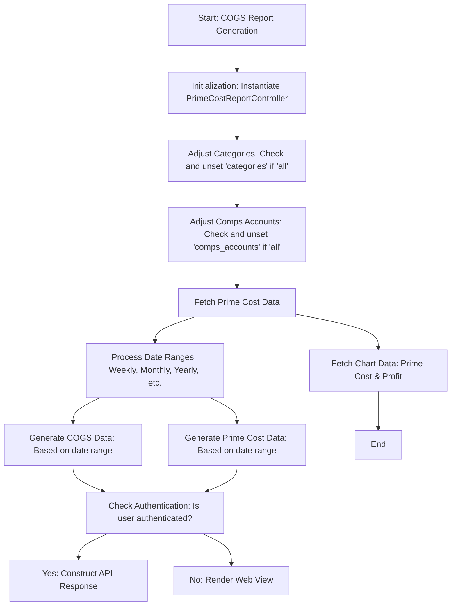

#### `/report/cogs-report/detailed/run` - `POST`

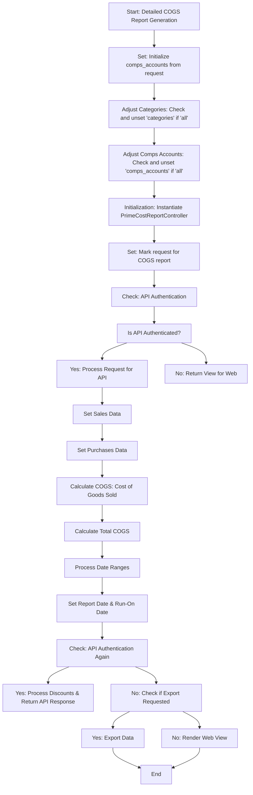

#### `/report/compare-report` - `POST`

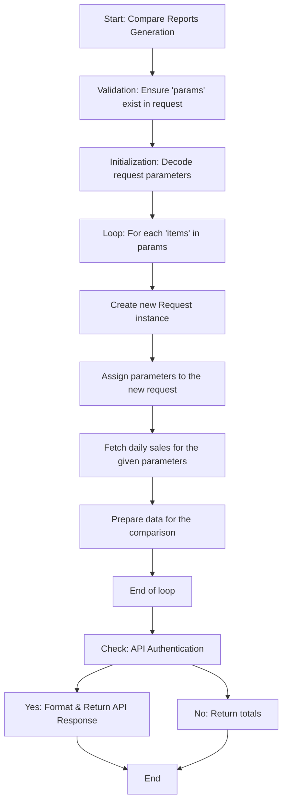

#### `/report/detailed/cogs-report` - `GET`

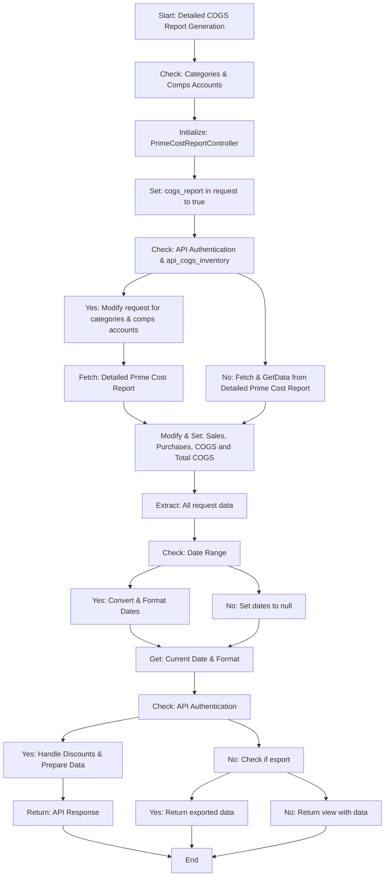

#### `/report/detailed/prime-cost-report` - `POST`

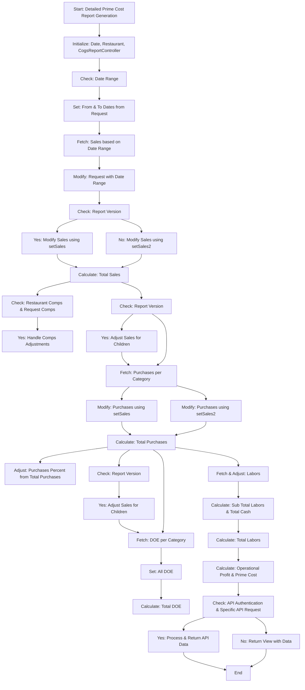

#### `/report/detailed/purchase-report` - `GET`

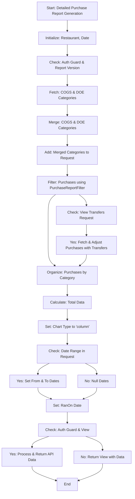

#### `/report/guest-count` - `GET`

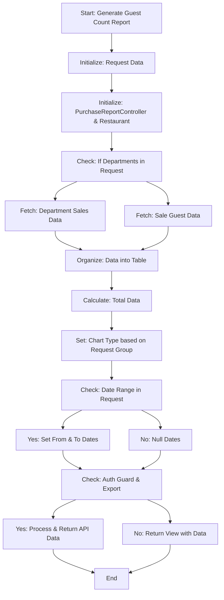

#### `/report/inventory` - `GET`

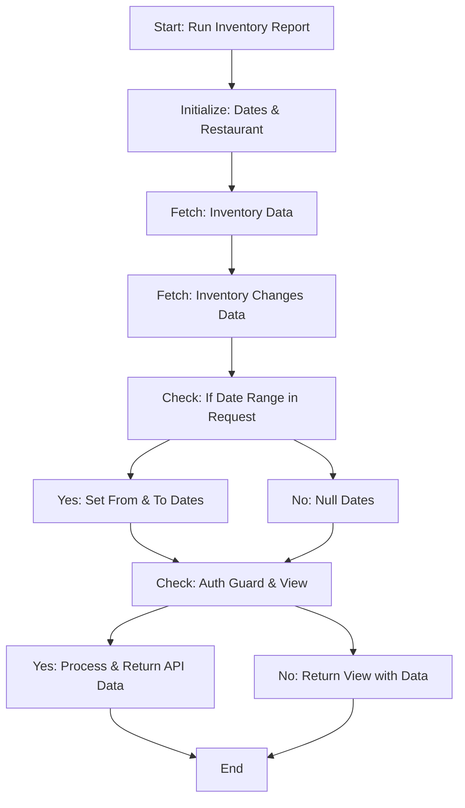

#### `/report/labor` - `GET`

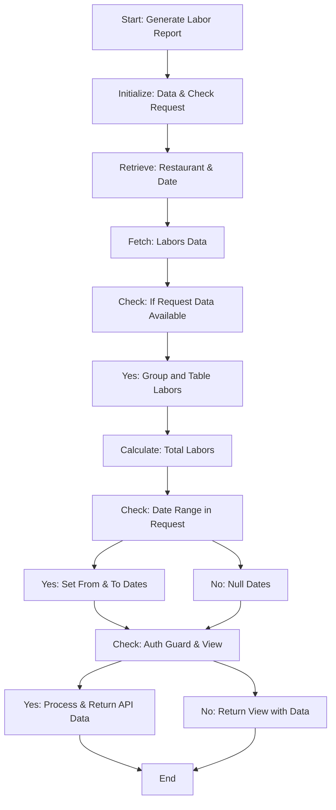

#### `/report/labor/detailed/category` - `GET`

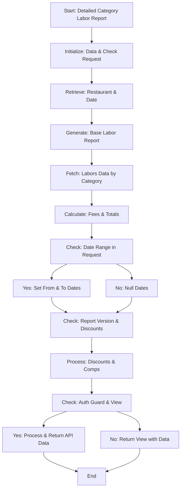

#### `/report/labor/efficiency` - `GET`

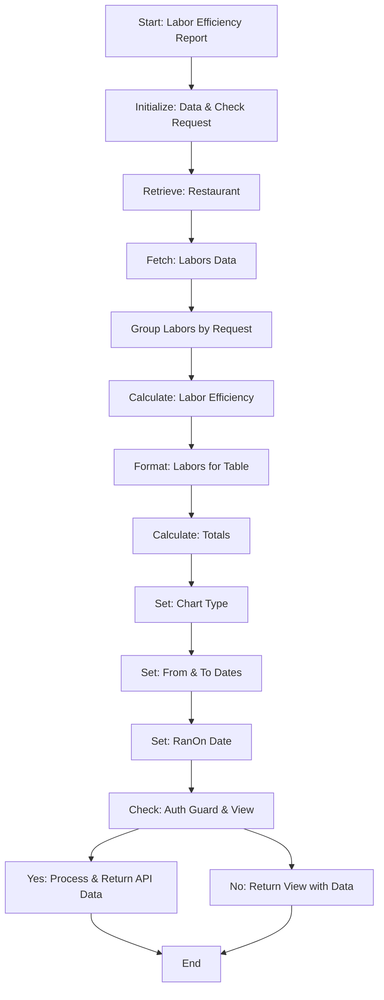

#### `/report/labor/efficiency/export` - `POST`

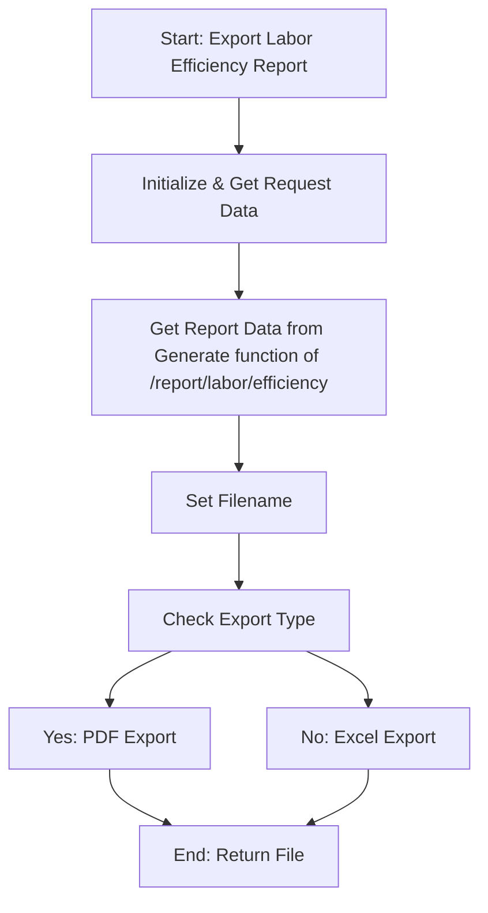

#### `/report/labor/export` - `POST`

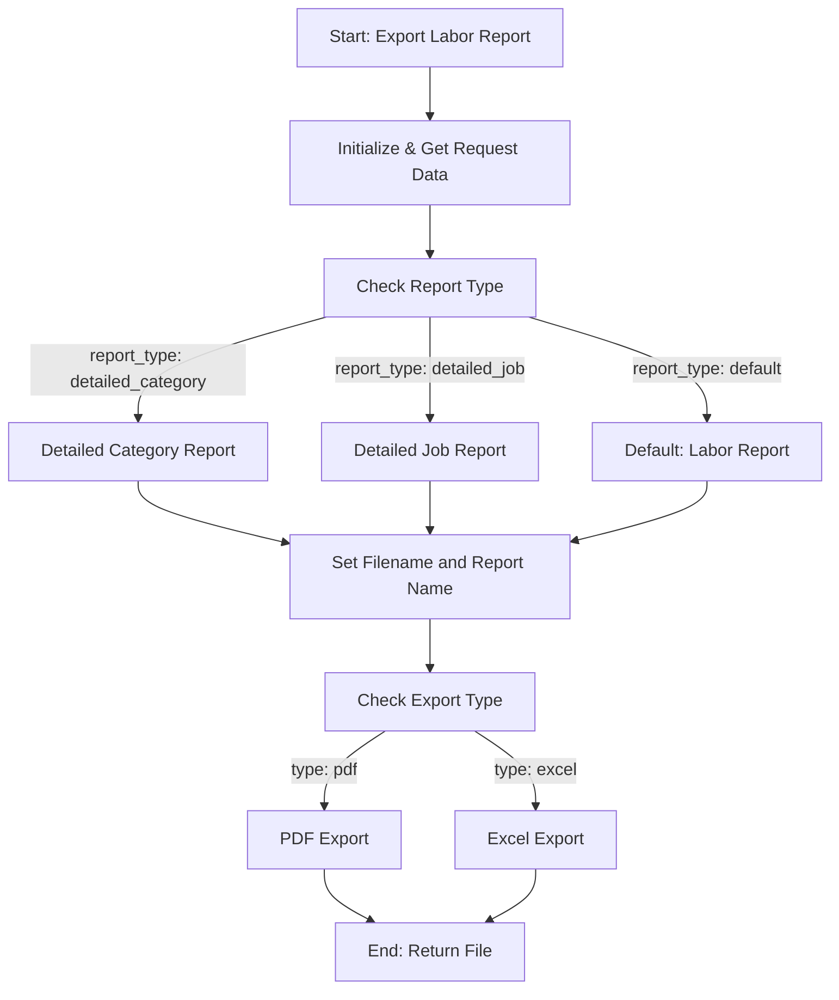

#### `/report/monthly-overview` - `GET`

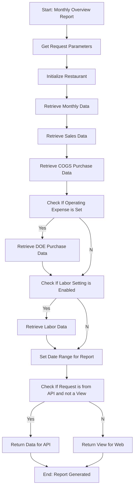

#### `/report/operational-profit` - `GET`

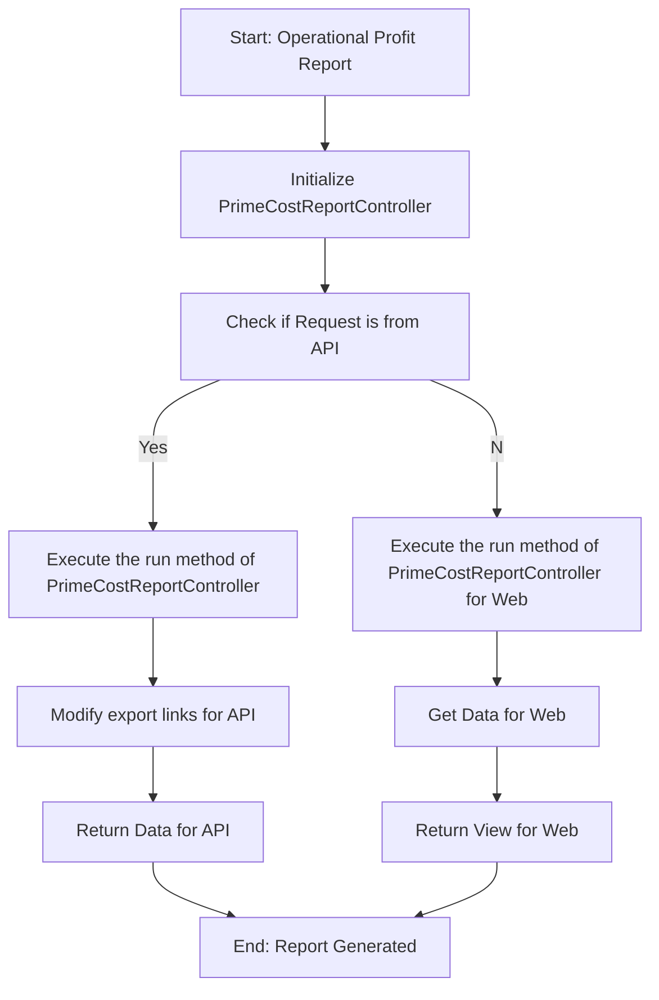

#### `/report/options` - `GET`

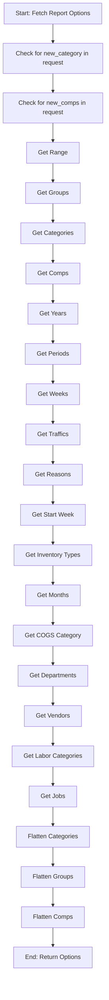

#### `/report/overview-report/export` - `POST`

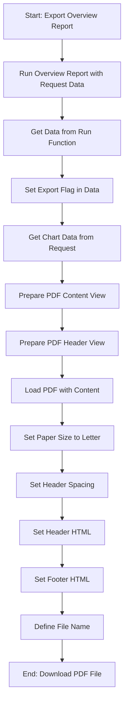

#### `/report/per-person-avg` - `GET`

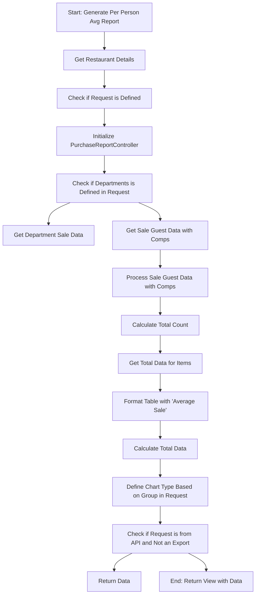

#### `/report/prime-cost-report` - `GET`

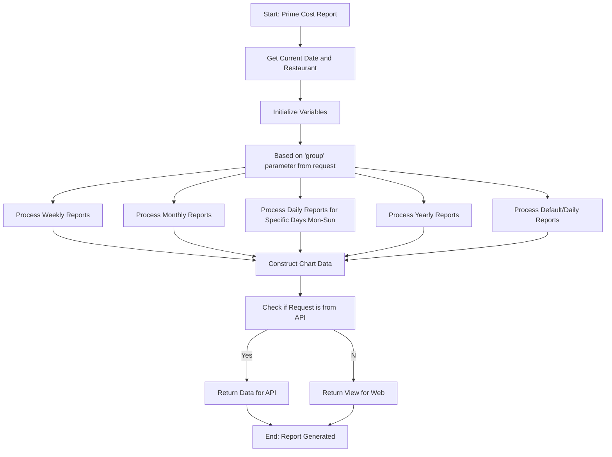

#### `/report/prime-cost-report/export` - `POST`

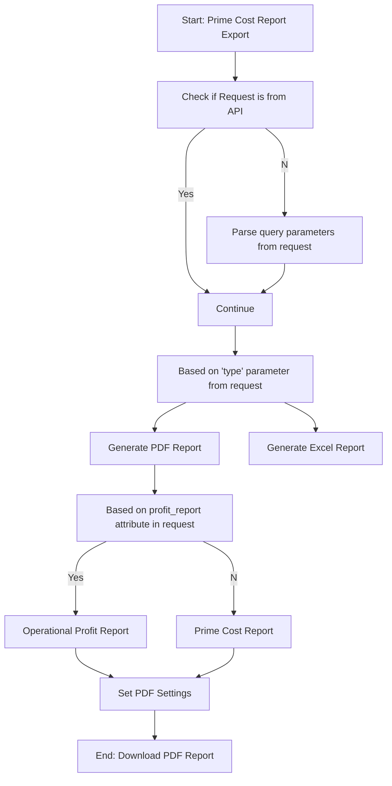

#### `/report/prime-cost-report/export/detailed` - `POST`

```mermaid
graph TD
    A[Start: Prime Cost Report Detailed Export]
    B[Check if Request is from API or has 'query' attribute]
    C1[Parse query parameters from request]
    C2[Continue]
    D[Based on 'type' parameter from request]
    E1[Generate Detailed PDF Report]
    E2[Generate Detailed Excel Report]
    F[Get data for report]
    G[Check if profit_report attribute is set in request]
    H1[Operational Profit Detailed Report]
    H2[Prime Cost Inventory Report]
    H3[Prime Cost Detailed Report]
    I[Set PDF Settings]
    J[End: Download PDF Report]

    A --> B
    B --Yes--> C2
    B --No--> C1
    C1 --> C2
    C2 --> D
    D --> E1
    D --> E2
    E1 --> F
    F --> G
    G --Yes--> H1
    G --prime_cost_inventory_report is set--> H2
    G --No--> H3
    H1 --> I
    H2 --> I
    H3 --> I
    I --> J
```

#### `/report/profit-loss` - `GET`

```mermaid
graph TD
    A[Start: Profit & Loss Report]
    B[Initialize start and end dates]
    C{Check if from date is provided in request}
    D1[Set default date to start of last month]
    D2[Convert from and to from request to Carbon dates]
    E[Get range from start and end dates]
    F[Calculate COGS Sales]
    G[Calculate Purchases]
    H[Calculate DOE]
    I[Calculate Expenses]
    J[Calculate Labor]
    K[Compute Prime Cost, Controllable Expense, Total Expense, and Operational Profit]
    L{Check if request is from API and not for view}
    M1[Prepare API data response]
    M2[Generate Report View]
    N[End: Return API data]
    O[End: Return Report View]

    A --> B
    B --> C
    C --No--> D1
    C --Yes--> D2
    D1 --> E
    D2 --> E
    E --> F
    F --> G
    G --> H
    H --> I
    I --> J
    J --> K
    K --> L
    L --Yes--> M1
    L --No--> M2
    M1 --> N
    M2 --> O

    subgraph salesCogs
        F --> P[Get COGS Categories and their Sales]
        P --> Q[Compute Sum and Percentage of Sales]
    end
```

#### `/report/profit-loss/export` - `POST`

```mermaid
graph TD
    A[Start: Export Profit & Loss Report]
    B{Check if request is from API}
    C1[Invoke index for API data]
    C2[Invoke index for View data]
    D[Prepare the data for PDF export]
    E[Load PDF with the content]
    F[Set PDF options]
    G[End: Return downloaded PDF]

    A --> B
    B --API--> C1
    B --Not API--> C2
    C1 --> D
    C2 --> D
    D --> E
    E --> F
    F --> G

    subgraph index
        C1 --> I1[Initialize start and end dates]
        C2 --> I1
        I1 --> I2[Compute range]
        I2 --> I3[Calculate COGS Sales, Purchases, DOE, Expenses, and Labor]
        I3 --> I4[Compute Prime Cost and related metrics]
        I4 --> I5[Check if Discounts table is needed]
        I5 --> I6[Get Sales Data, Calculate COGS and other metrics]
    end
```

#### `/report/purchase-report` - `GET`

```mermaid
graph TD
    A[Start: Generate Purchase Report]
    B{Check for restaurant}
    C[Set restaurant]
    D{Check if request is from API and has report_version}
    E[Check for request categories]
    F[Include Category Children]
    G[Initialize Purchase Filters]
    H[Get Purchases]
    I[Apply Expenses]
    J{Check if view_transfers input is set}
    K[Apply Transfers]
    L[Sort and Serialize Purchases]
    M[Calculate Table]
    N[Calculate Totals]
    O[Set Chart Type]
    P{Check for date range in request}
    Q[Set Dates]
    R[Return View]
    S[End: Return API data]

    A --> B
    B --No restaurant--> C
    C --> D
    B --Restaurant present--> D
    D --API request with report_version--> E
    D --Not an API request with report_version--> G
    E --> F
    F --> G
    G --> H
    H --> I
    I --> J
    J --view_transfers set--> K
    J --view_transfers not set--> L
    K --> L
    L --> M
    M --> N
    N --> O
    O --> P
    P --Date range provided--> Q
    P --No date range provided--> R
    Q --> R
    R --API request with no view--> S
    R --Not an API request--> END[Return View]
    S --> END[Return Data as API Response]

    subgraph expenses
        I --> X1[Initialize date range]
        X1 --> X2[Return purchases]
    end
```

#### `/report/purchase/export` - `POST`

```mermaid
graph TD
    A[Start: Export Purchase Report]
    B[Retrieve all request data]
    C{Check if detailed report requested}
    D[Generate Detailed Report]
    E[Generate Standard Report]
    F[Set Filename]
    G{Check Report Type}
    H[Generate PDF]
    I[Generate Excel]
    J[End]

    A --> B
    B --> C
    C --Yes--> D
    C --No--> E
    D --> F
    E --> F
    F --> G
    G --PDF--> H
    G --Excel--> I
    H --> J
    I --> J

    subgraph DetailedReportFlow
        D --> X1[Set Restaurant if not set]
        X1 --> X2[Set Date if not set]
        X2 --> X3{Check if request is from API with report_version}
        X3 --Yes--> X4[Retrieve categories and filters]
        X4 --> X5[Get Purchases by filter]
        X3 --No--> X5
        X5 --> X6{Check if view_transfers is set in request}
        X6 --Yes--> X7[Apply Transfers]
        X7 --> X8[Serialize and Categorize Purchases]
        X6 --No--> X8
        X8 --> X9[Calculate Totals]
        X9 --> X10[Set Chart Type and Retrieve other data]
    end

```

#### `/report/purchase/vendor` - `GET`

```mermaid
graph TD
    A[Start: Run Purchase Vendor Report]
    B[Set default restaurant if not present]
    C[Set default date if not present]
    D[Fetch invoices per vendor]
    E[Group invoices by vendor ID]
    F[Initialize chart and sum]
    G[For each vendor in vendors]
    H[Find Vendor from Vendor ID]
    I[Calculate total for each purchase]
    J[If Vendor exists, add to chart]
    K[Update Sum]
    L[Set date range]
    M[Format invoice date]
    N[If request is from API and not view]
    O[Prepare data for API]
    P[Return data]
    Q[Else, prepare data for view]
    R[Return view]

    A --> B
    B --> C
    C --> D
    D --> E
    E --> F
    F --> G
    G --> H
    H --> I
    I --> J
    J --> K
    K -->|For each vendor| G
    K --> L
    L --> M
    M --> N
    N --> O
    O --> P
    N --> Q
    Q --> R
```

#### `/report/purchase/vendor/export` - `POST`

```mermaid
graph TD
    A[Start: Export Purchase Vendor Report]
    B{Check request type}
    C[Export as PDF]
    D[Prepare Data for PDF]
    E[Load PDF view and Download]
    F[Export as Excel]
    G[Prepare Data for Excel]
    H[Format Excel using excel_format]
    I[End]

    A --> B
    B --PDF--> C
    C --> D
    D --> E
    E --> I
    B --Excel--> F
    F --> G
    G --> H
    H --> I

```

#### `/report/sales-daily` - `GET`

```mermaid
graph TD
    A[Start: Sales Daily Report]
    B{Check for restaurant}
    C[Use passed restaurant]
    D[Use default restaurant]
    E[Initialize variables]
    F{Check if API request}
    G[Process Categories for COGS]
    H{Detailed Request Check}
    I{Traffic Report Check}
    J[Set Detailed Report Name]
    K[Set Traffic Report Name]
    L[Set Sales Report Name]
    M{Detailed Report Check Back Link}
    N[Set Detailed Back Link]
    O[Set Back Link]
    P{Is request scheduled?}
    Q[Process Sales Data]
    R[Process Sales Chart Data]
    S{Detailed Report Check}
    T[Format Sales Data]
    U{Check for API Request}
    V[Prepare API Response]
    W[Return View]

    A --> B
    B --> |Yes| C
    B --> |No| D
    C --> E
    D --> E
    E --> F
    F --> |Yes| G
    F --> |No| H
    G --> H
    H --> |Yes| I
    H --> |No| I
    I --> |Yes| K
    I --> |No| J
    K --> L
    J --> L
    L --> M
    M --> |Yes| N
    M --> |No| O
    N --> P
    O --> P
    P --> |No| Q
    Q --> R
    R --> S
    S --> |Yes| T
    S --> |No| U
    T --> U
    U --> V
    V --> W
```

#### `/report/sales-daily/export` - `POST`

```mermaid
graph TD
    start((Start: Sales Daily Export))
    departmentCheck{Check 'sales_by_department' input}
    salesDataCall[Call: sales_daily function]
    checkExportType{Check export type}
    pdfExport[Export PDF]
    excelExport[Export Excel]

    subgraph sales_daily_function [Sales Daily Function]
    A[Start: Sales Daily Report]
    B[Initialize variables]
    C[Check API guard and report_version]
    D[Check 'detailed' input]
    E[Set Report Name based on Department]
    F[Set Report Name based on Traffic Report]
    G[Set Default Sales Report Name]
    H[Check 'detailed' input for Back Link]
    I[Set Back Link]
    J[Check if Request is Scheduled]
    K[Process Sales Data]
    L[Check 'detailed' and 'categories']
    M[Set Sales Data]
    N[Return API Data]
    O[Return View]
    end

    start --> departmentCheck
    departmentCheck --> salesDataCall
    salesDataCall --> checkExportType
    N --> checkExportType
    checkExportType --> |pdf| pdfExport
    checkExportType --> |excel| excelExport

    salesDataCall --> A
    A --> B
    B --> C
    C --> D
    D --> |Yes| E
    D --> |No| F
    F --> G
    G --> H
    H --> |No| I
    I --> J
    J --> |No| K
    K --> L
    L --> M
    M --> N
    N --> O

```

#### `/report/sales/guest_count/export` - `POST`

```mermaid
graph TD
    start((Start: Guest Count Export))
    requestData[Get request data]
    callGenerate[Call: generate function]
    checkExportType{Check export type}
    pdfExport[Export PDF]
    excelExport[Export Excel]

    subgraph generate_function [Generate Function]
    A[Start: Generate Report]
    B[Initialize variables]
    C[Check if request is null]
    D[Initialize Restaurant]
    E[Check for 'departments' in request]
    F[Get Department Sale Data]
    G[Get Sale Guest Data]
    H[Process Table Data]
    I[Calculate Totals]
    J[Set Chart Type]
    K[Check if API Guard & Not Export]
    L[Prepare API Data]
    M[Return View]
    end

    start --> requestData
    requestData --> callGenerate
    callGenerate --> checkExportType
    L --> checkExportType
    checkExportType --> |pdf| pdfExport
    checkExportType --> |excel| excelExport

    callGenerate --> A
    A --> B
    B --> C
    C --> D
    D --> E
    E --> |Yes| F
    E --> |No| G
    F --> H
    G --> H
    H --> I
    I --> J
    J --> K
    K --> L
    L --> M
```

#### `/report/sales/per_person/export` - `POST`

```mermaid
graph TD
    start((Start: Per Person Export))
    requestData[Get request data]
    callGenerate[Call: generate function]
    checkExportType{Check export type}
    pdfExport[Export PDF]
    excelExport[Export Excel]

    subgraph generate_function [Generate Function]
    A[Start: Generate Report]
    B[Initialize Restaurant]
    C[Get Request Data if null]
    D[Initialize PurchaseReportController]
    E[Check if 'departments' in request]
    F[Get Department Sale Data]
    G[Get Sale Guest Data]
    H[Process Sale Guest Data with Comps]
    I[Calculate Totals for Items]
    J[Process Table Data]
    K[Calculate Overall Totals]
    L[Set Chart Type]
    M[Check if API Guard & Not Export]
    N[Prepare API Data]
    O[Return View]
    end

    start --> requestData
    requestData --> callGenerate
    callGenerate --> checkExportType
    N --> checkExportType
    checkExportType --> |pdf| pdfExport
    checkExportType --> |excel| excelExport

    callGenerate --> A
    A --> B
    B --> C
    C --> D
    D --> E
    E --> |Yes| F
    E --> |No| G
    G --> H
    H --> I
    I --> J
    J --> K
    K --> L
    L --> M
    M --> N
    N --> O
```

#

---

#### `/partner-company/` - `POST`

```mermaid
graph TD
    start((Start: Store Partner Company))
    createCompany[Create Partner Company]
    syncCompanyRestaurants[Sync Restaurants to Company]
    callSaveUsers[Call: _saveNewUsers function]
    syncCompanyUsers[Sync Users to Company]
    returnResponse[Return Response]

    subgraph saveNewUsers_function [_saveNewUsers Function]
    A[Start: Save New Users]
    B[Initialize User IDs]
    C{Iterate over Users}
    D[Check if New User]
    E[Create New User]
    F[Disable Restaurant Access]
    G[Send Activation Email]
    H[Add ID to List]
    I[Check if Existing New User]
    J[Find and Update User]
    K[Send Partner User Email]
    L[Log Account Activity]
    M[Add ID to List]
    N[Check if Existing User]
    O[Add ID to List]
    P[End Iteration]
    end

    start --> createCompany
    createCompany --> syncCompanyRestaurants
    syncCompanyRestaurants --> callSaveUsers
    callSaveUsers --> syncCompanyUsers
    syncCompanyUsers --> returnResponse

    callSaveUsers --> A
    A --> B
    B --> C
    C --> |For each User| D
    D --> |New User| E
    E --> F
    F --> G
    G --> H
    H --> P
    D --> |Existing New User| I
    I --> J
    J --> K
    K --> L
    L --> M
    M --> P
    D --> |Existing User| N
    N --> O
    O --> P
    P --> |Next User| C
    C --> |End of Users| returnResponse

```

#### `/partner-company/{company}` - `GET`

```mermaid
graph TD
    A[Start: Show Partner Company]
    B{Check if User is Partner Admin}
    C{Check if Company ID matches User's Partner Company ID}
    D[Abort with 403]
    E[Return Company Data]

    A --> B
    B --> |Yes| C
    C --> |No| D
    C --> |Yes| E
    B --> |No| E
```

#

---

#### `/report-suggestion/ajax` - `GET`

```mermaid
graph TD
    A[Start: Ajax Call]
    B{Check if User Role is 1 Admin}
    C[Set Report Suggestion Query for Admin]
    D[Set Report Suggestion Query for User]
    E{Sort Direction Check}
    F[Descending Order]
    G[Ascending Order]
    H{Keyword Check}
    I[Apply Keyword Filter]
    J{Filter Parameter Check}
    K[Apply Filters]
    L{Check if User is from API Guard}
    M[Apply Pagination]
    N[Datatables Transformation]
    O[End: Return Datatables]

    A --> B
    B --> |Yes| C
    B --> |No| D
    C --> E
    D --> E
    E --> |Descending| F
    E --> |Ascending| G
    F --> H
    G --> H
    H --> |Keyword exists| I
    I --> J
    H --> |No Keyword| J
    J --> |Filters exist| K
    K --> L
    J --> |No Filters| L
    L --> |API Guard User| M
    M --> N
    L --> |Non-API Guard User| N
    N --> O
```
