# Technical Documentation

### report

#### `/report/cogs-report` - `GET`

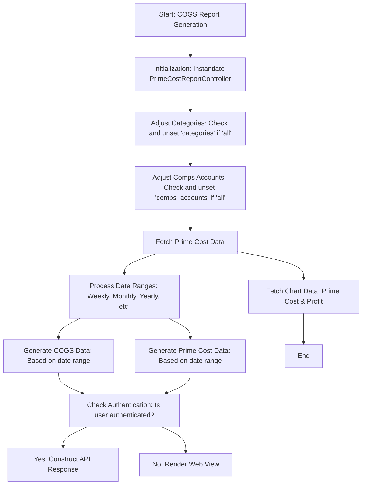

#### `/report/cogs-report/detailed/run` - `POST`

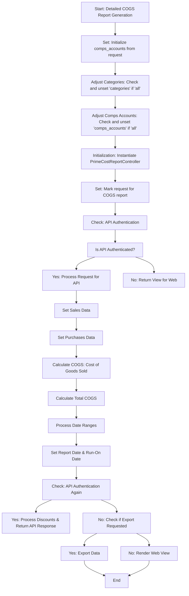

#### `/report/compare-report` - `POST`

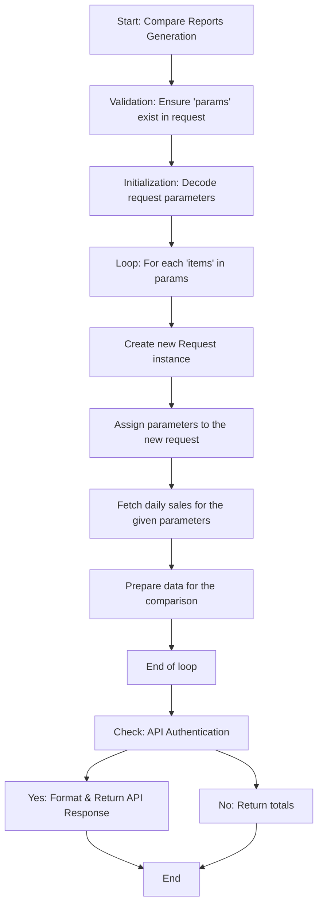

#### `/report/detailed/cogs-report` - `GET`

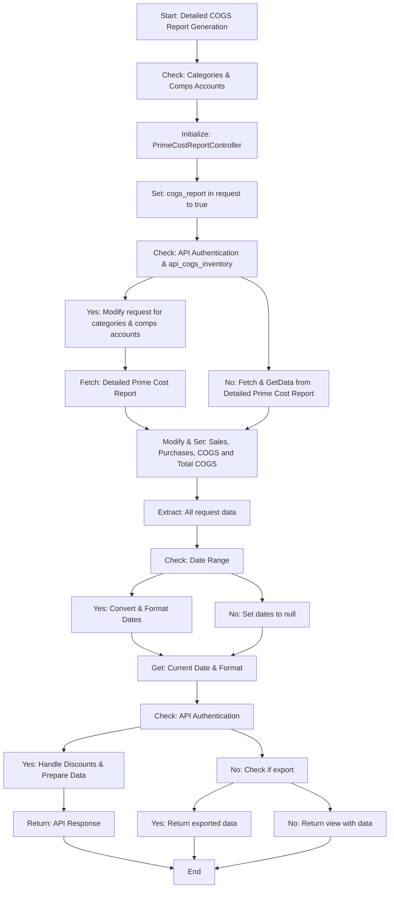

#### `/report/detailed/prime-cost-report` - `POST`

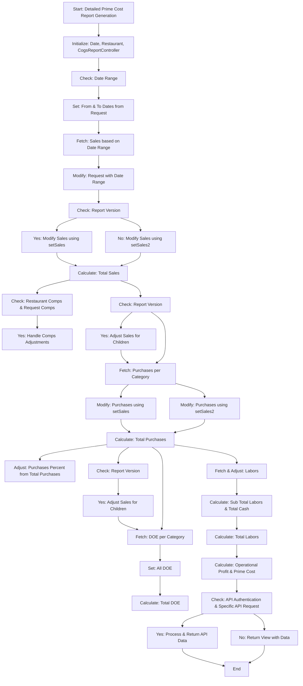

#### `/report/detailed/purchase-report` - `GET`

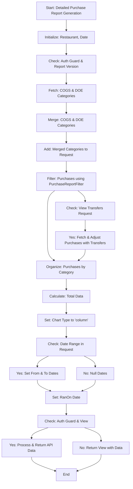

#### `/report/guest-count` - `GET`

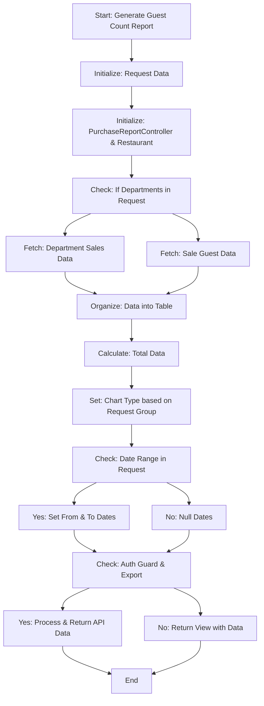

#### `/report/inventory` - `GET`

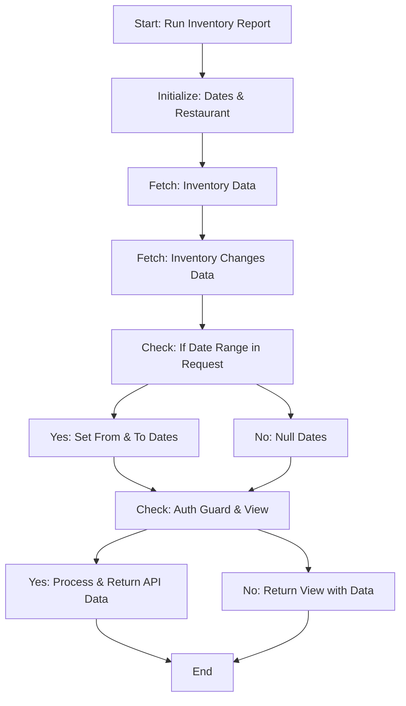

#### `/report/labor` - `GET`

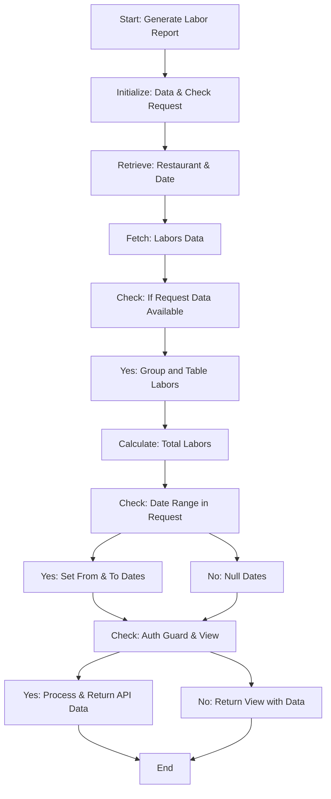

#### `/report/labor/detailed/category` - `GET`

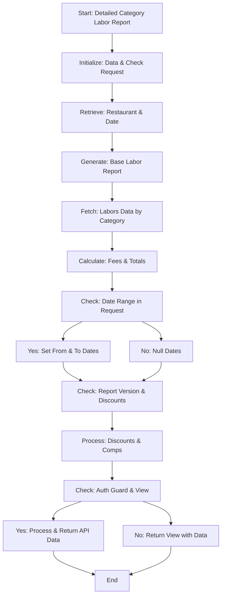

#### `/report/labor/efficiency` - `GET`

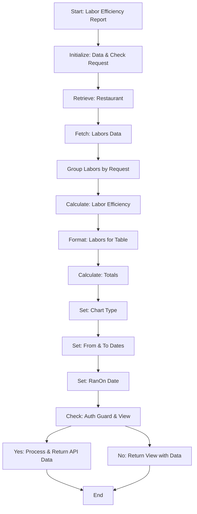

#### `/report/labor/efficiency/export` - `POST`

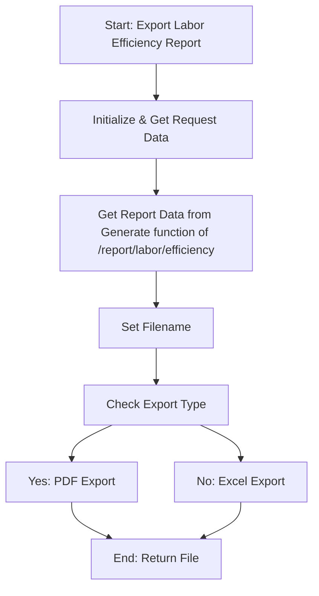

#### `/report/labor/export` - `POST`

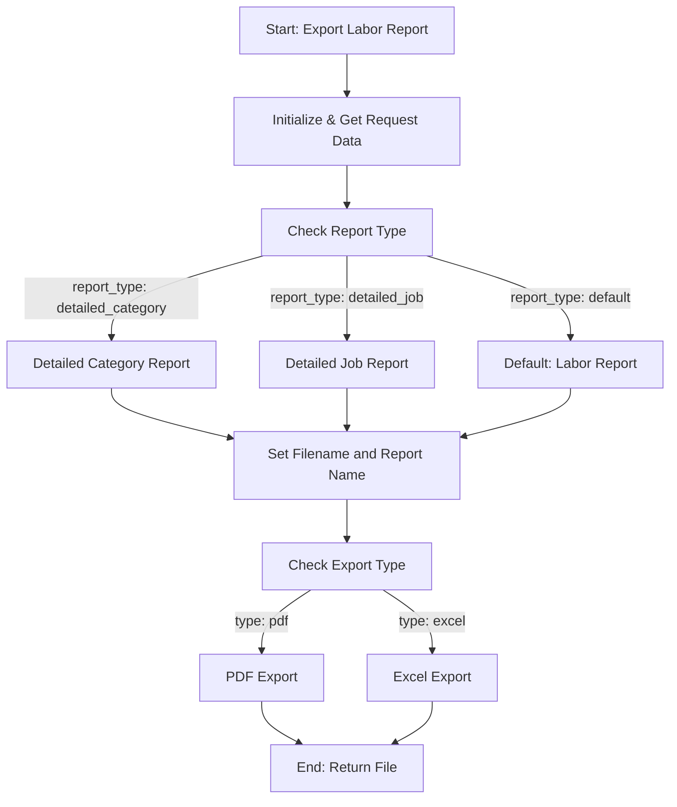

#### `/report/monthly-overview` - `GET`

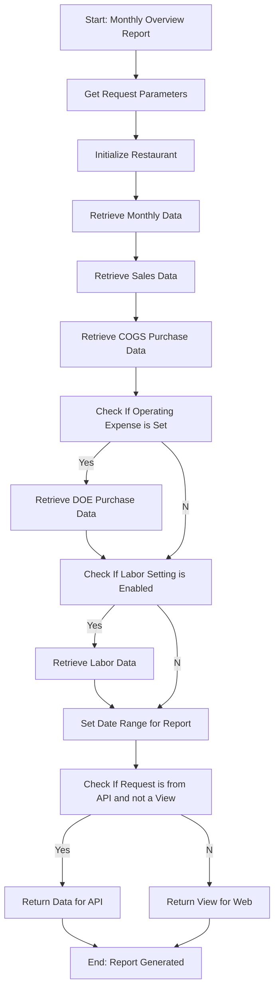

#### `/report/operational-profit` - `GET`

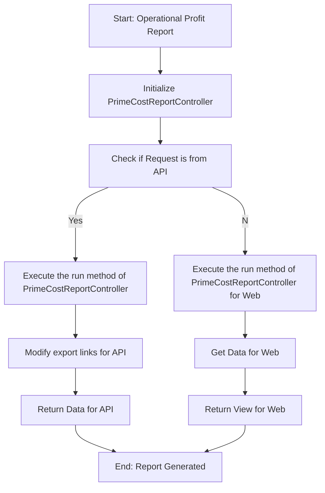

#### `/report/options` - `GET`

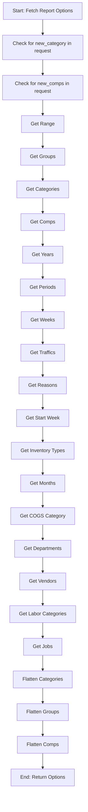

#### `/report/overview-report/export` - `POST`

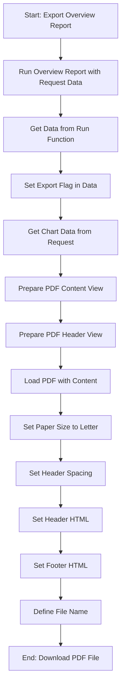

#### `/report/per-person-avg` - `GET`

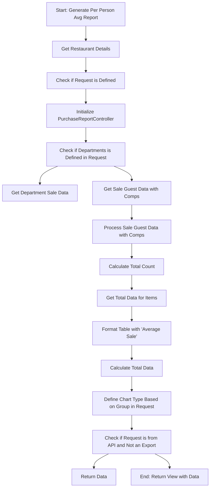

#### `/report/prime-cost-report` - `GET`

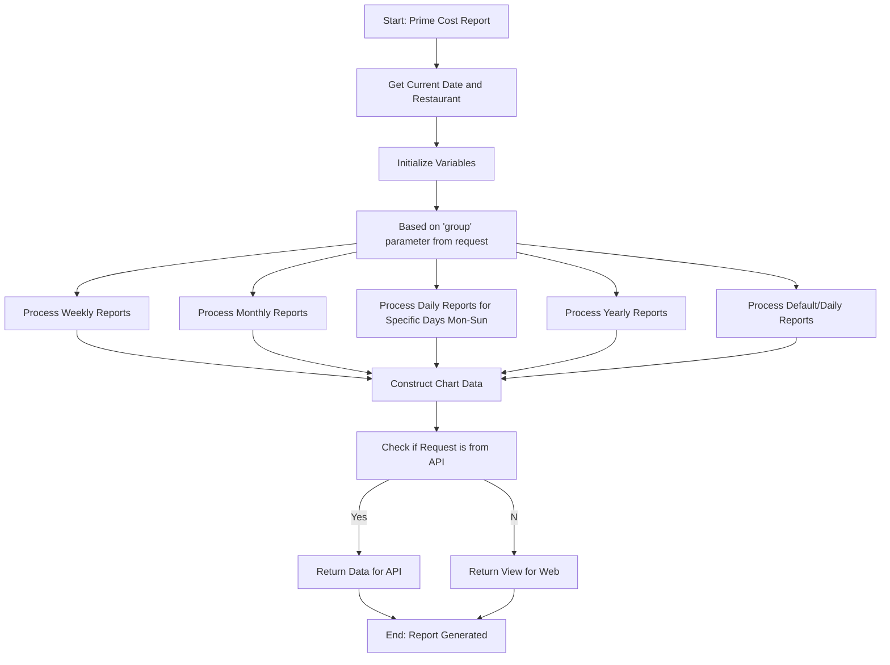

#### `/report/prime-cost-report/export` - `POST`

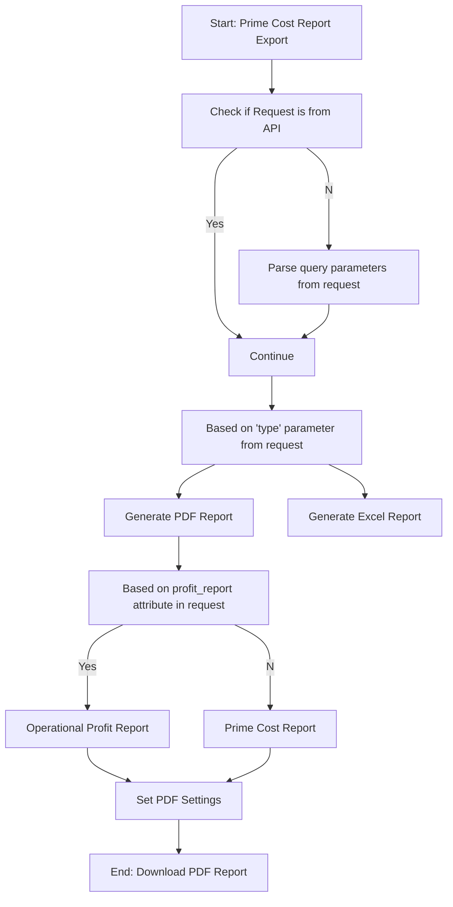

#### `/report/prime-cost-report/export/detailed` - `POST`

```mermaid
graph TD
    A[Start: Prime Cost Report Detailed Export]
    B[Check if Request is from API or has 'query' attribute]
    C1[Parse query parameters from request]
    C2[Continue]
    D[Based on 'type' parameter from request]
    E1[Generate Detailed PDF Report]
    E2[Generate Detailed Excel Report]
    F[Get data for report]
    G[Check if profit_report attribute is set in request]
    H1[Operational Profit Detailed Report]
    H2[Prime Cost Inventory Report]
    H3[Prime Cost Detailed Report]
    I[Set PDF Settings]
    J[End: Download PDF Report]

    A --> B
    B --Yes--> C2
    B --No--> C1
    C1 --> C2
    C2 --> D
    D --> E1
    D --> E2
    E1 --> F
    F --> G
    G --Yes--> H1
    G --prime_cost_inventory_report is set--> H2
    G --No--> H3
    H1 --> I
    H2 --> I
    H3 --> I
    I --> J
```

#### `/report/profit-loss` - `GET`

```mermaid
graph TD
    A[Start: Profit & Loss Report]
    B[Initialize start and end dates]
    C{Check if from date is provided in request}
    D1[Set default date to start of last month]
    D2[Convert from and to from request to Carbon dates]
    E[Get range from start and end dates]
    F[Calculate COGS Sales]
    G[Calculate Purchases]
    H[Calculate DOE]
    I[Calculate Expenses]
    J[Calculate Labor]
    K[Compute Prime Cost, Controllable Expense, Total Expense, and Operational Profit]
    L{Check if request is from API and not for view}
    M1[Prepare API data response]
    M2[Generate Report View]
    N[End: Return API data]
    O[End: Return Report View]

    A --> B
    B --> C
    C --No--> D1
    C --Yes--> D2
    D1 --> E
    D2 --> E
    E --> F
    F --> G
    G --> H
    H --> I
    I --> J
    J --> K
    K --> L
    L --Yes--> M1
    L --No--> M2
    M1 --> N
    M2 --> O

    subgraph salesCogs
        F --> P[Get COGS Categories and their Sales]
        P --> Q[Compute Sum and Percentage of Sales]
    end
```

#### `/report/profit-loss/export` - `POST`

```mermaid
graph TD
    A[Start: Export Profit & Loss Report]
    B{Check if request is from API}
    C1[Invoke index for API data]
    C2[Invoke index for View data]
    D[Prepare the data for PDF export]
    E[Load PDF with the content]
    F[Set PDF options]
    G[End: Return downloaded PDF]

    A --> B
    B --API--> C1
    B --Not API--> C2
    C1 --> D
    C2 --> D
    D --> E
    E --> F
    F --> G

    subgraph index
        C1 --> I1[Initialize start and end dates]
        C2 --> I1
        I1 --> I2[Compute range]
        I2 --> I3[Calculate COGS Sales, Purchases, DOE, Expenses, and Labor]
        I3 --> I4[Compute Prime Cost and related metrics]
        I4 --> I5[Check if Discounts table is needed]
        I5 --> I6[Get Sales Data, Calculate COGS and other metrics]
    end
```

#### `/report/purchase-report` - `GET`

```mermaid
graph TD
    A[Start: Generate Purchase Report]
    B{Check for restaurant}
    C[Set restaurant]
    D{Check if request is from API and has report_version}
    E[Check for request categories]
    F[Include Category Children]
    G[Initialize Purchase Filters]
    H[Get Purchases]
    I[Apply Expenses]
    J{Check if view_transfers input is set}
    K[Apply Transfers]
    L[Sort and Serialize Purchases]
    M[Calculate Table]
    N[Calculate Totals]
    O[Set Chart Type]
    P{Check for date range in request}
    Q[Set Dates]
    R[Return View]
    S[End: Return API data]

    A --> B
    B --No restaurant--> C
    C --> D
    B --Restaurant present--> D
    D --API request with report_version--> E
    D --Not an API request with report_version--> G
    E --> F
    F --> G
    G --> H
    H --> I
    I --> J
    J --view_transfers set--> K
    J --view_transfers not set--> L
    K --> L
    L --> M
    M --> N
    N --> O
    O --> P
    P --Date range provided--> Q
    P --No date range provided--> R
    Q --> R
    R --API request with no view--> S
    R --Not an API request--> END[Return View]
    S --> END[Return Data as API Response]

    subgraph expenses
        I --> X1[Initialize date range]
        X1 --> X2[Return purchases]
    end
```

#### `/report/purchase/export` - `POST`

```mermaid
graph TD
    A[Start: Export Purchase Report]
    B[Retrieve all request data]
    C{Check if detailed report requested}
    D[Generate Detailed Report]
    E[Generate Standard Report]
    F[Set Filename]
    G{Check Report Type}
    H[Generate PDF]
    I[Generate Excel]
    J[End]

    A --> B
    B --> C
    C --Yes--> D
    C --No--> E
    D --> F
    E --> F
    F --> G
    G --PDF--> H
    G --Excel--> I
    H --> J
    I --> J

    subgraph DetailedReportFlow
        D --> X1[Set Restaurant if not set]
        X1 --> X2[Set Date if not set]
        X2 --> X3{Check if request is from API with report_version}
        X3 --Yes--> X4[Retrieve categories and filters]
        X4 --> X5[Get Purchases by filter]
        X3 --No--> X5
        X5 --> X6{Check if view_transfers is set in request}
        X6 --Yes--> X7[Apply Transfers]
        X7 --> X8[Serialize and Categorize Purchases]
        X6 --No--> X8
        X8 --> X9[Calculate Totals]
        X9 --> X10[Set Chart Type and Retrieve other data]
    end

```

#### `/report/purchase/vendor` - `GET`

```mermaid
graph TD
    A[Start: Run Purchase Vendor Report]
    B[Set default restaurant if not present]
    C[Set default date if not present]
    D[Fetch invoices per vendor]
    E[Group invoices by vendor ID]
    F[Initialize chart and sum]
    G[For each vendor in vendors]
    H[Find Vendor from Vendor ID]
    I[Calculate total for each purchase]
    J[If Vendor exists, add to chart]
    K[Update Sum]
    L[Set date range]
    M[Format invoice date]
    N[If request is from API and not view]
    O[Prepare data for API]
    P[Return data]
    Q[Else, prepare data for view]
    R[Return view]

    A --> B
    B --> C
    C --> D
    D --> E
    E --> F
    F --> G
    G --> H
    H --> I
    I --> J
    J --> K
    K -->|For each vendor| G
    K --> L
    L --> M
    M --> N
    N --> O
    O --> P
    N --> Q
    Q --> R
```

#### `/report/purchase/vendor/export` - `POST`

```mermaid
graph TD
    A[Start: Export Purchase Vendor Report]
    B{Check request type}
    C[Export as PDF]
    D[Prepare Data for PDF]
    E[Load PDF view and Download]
    F[Export as Excel]
    G[Prepare Data for Excel]
    H[Format Excel using excel_format]
    I[End]

    A --> B
    B --PDF--> C
    C --> D
    D --> E
    E --> I
    B --Excel--> F
    F --> G
    G --> H
    H --> I

```

#### `/report/sales-daily` - `GET`

```mermaid
graph TD
    A[Start: Sales Daily Report]
    B{Check for restaurant}
    C[Use passed restaurant]
    D[Use default restaurant]
    E[Initialize variables]
    F{Check if API request}
    G[Process Categories for COGS]
    H{Detailed Request Check}
    I{Traffic Report Check}
    J[Set Detailed Report Name]
    K[Set Traffic Report Name]
    L[Set Sales Report Name]
    M{Detailed Report Check Back Link}
    N[Set Detailed Back Link]
    O[Set Back Link]
    P{Is request scheduled?}
    Q[Process Sales Data]
    R[Process Sales Chart Data]
    S{Detailed Report Check}
    T[Format Sales Data]
    U{Check for API Request}
    V[Prepare API Response]
    W[Return View]

    A --> B
    B --> |Yes| C
    B --> |No| D
    C --> E
    D --> E
    E --> F
    F --> |Yes| G
    F --> |No| H
    G --> H
    H --> |Yes| I
    H --> |No| I
    I --> |Yes| K
    I --> |No| J
    K --> L
    J --> L
    L --> M
    M --> |Yes| N
    M --> |No| O
    N --> P
    O --> P
    P --> |No| Q
    Q --> R
    R --> S
    S --> |Yes| T
    S --> |No| U
    T --> U
    U --> V
    V --> W
```

#### `/report/sales-daily/export` - `POST`

```mermaid
graph TD
    start((Start: Sales Daily Export))
    departmentCheck{Check 'sales_by_department' input}
    salesDataCall[Call: sales_daily function]
    checkExportType{Check export type}
    pdfExport[Export PDF]
    excelExport[Export Excel]

    subgraph sales_daily_function [Sales Daily Function]
    A[Start: Sales Daily Report]
    B[Initialize variables]
    C[Check API guard and report_version]
    D[Check 'detailed' input]
    E[Set Report Name based on Department]
    F[Set Report Name based on Traffic Report]
    G[Set Default Sales Report Name]
    H[Check 'detailed' input for Back Link]
    I[Set Back Link]
    J[Check if Request is Scheduled]
    K[Process Sales Data]
    L[Check 'detailed' and 'categories']
    M[Set Sales Data]
    N[Return API Data]
    O[Return View]
    end

    start --> departmentCheck
    departmentCheck --> salesDataCall
    salesDataCall --> checkExportType
    N --> checkExportType
    checkExportType --> |pdf| pdfExport
    checkExportType --> |excel| excelExport

    salesDataCall --> A
    A --> B
    B --> C
    C --> D
    D --> |Yes| E
    D --> |No| F
    F --> G
    G --> H
    H --> |No| I
    I --> J
    J --> |No| K
    K --> L
    L --> M
    M --> N
    N --> O

```

#### `/report/sales/guest_count/export` - `POST`

```mermaid
graph TD
    start((Start: Guest Count Export))
    requestData[Get request data]
    callGenerate[Call: generate function]
    checkExportType{Check export type}
    pdfExport[Export PDF]
    excelExport[Export Excel]

    subgraph generate_function [Generate Function]
    A[Start: Generate Report]
    B[Initialize variables]
    C[Check if request is null]
    D[Initialize Restaurant]
    E[Check for 'departments' in request]
    F[Get Department Sale Data]
    G[Get Sale Guest Data]
    H[Process Table Data]
    I[Calculate Totals]
    J[Set Chart Type]
    K[Check if API Guard & Not Export]
    L[Prepare API Data]
    M[Return View]
    end

    start --> requestData
    requestData --> callGenerate
    callGenerate --> checkExportType
    L --> checkExportType
    checkExportType --> |pdf| pdfExport
    checkExportType --> |excel| excelExport

    callGenerate --> A
    A --> B
    B --> C
    C --> D
    D --> E
    E --> |Yes| F
    E --> |No| G
    F --> H
    G --> H
    H --> I
    I --> J
    J --> K
    K --> L
    L --> M
```

#### `/report/sales/per_person/export` - `POST`

```mermaid
graph TD
    start((Start: Per Person Export))
    requestData[Get request data]
    callGenerate[Call: generate function]
    checkExportType{Check export type}
    pdfExport[Export PDF]
    excelExport[Export Excel]

    subgraph generate_function [Generate Function]
    A[Start: Generate Report]
    B[Initialize Restaurant]
    C[Get Request Data if null]
    D[Initialize PurchaseReportController]
    E[Check if 'departments' in request]
    F[Get Department Sale Data]
    G[Get Sale Guest Data]
    H[Process Sale Guest Data with Comps]
    I[Calculate Totals for Items]
    J[Process Table Data]
    K[Calculate Overall Totals]
    L[Set Chart Type]
    M[Check if API Guard & Not Export]
    N[Prepare API Data]
    O[Return View]
    end

    start --> requestData
    requestData --> callGenerate
    callGenerate --> checkExportType
    N --> checkExportType
    checkExportType --> |pdf| pdfExport
    checkExportType --> |excel| excelExport

    callGenerate --> A
    A --> B
    B --> C
    C --> D
    D --> E
    E --> |Yes| F
    E --> |No| G
    G --> H
    H --> I
    I --> J
    J --> K
    K --> L
    L --> M
    M --> N
    N --> O
```

### restaurant-summary-report

---

#### `/restaurant-summary-report` - `GET`

```mermaid
graph TD
    A[Start: Load Restaurant Summary Report]
    B[GetData: Fetch and Process Data]
        B1[Call ApiDashboardController->cogs]
        B2[Call ApiDashboardController->doeCards]
        B3[Call ApiDashboardController->compsCards]
        B4[Call ApiDashboardController->laborCards]
        B5[Process the collected data]
    C[Generate Restaurant Table Data]
        C1[Process COGS table]
        C2[Process DOE table]
        C3[Process Comps table]
        C4[Process Labor table]
        C5[Calculate totals]
    D[Return Report Data]
    E[Fetch Restaurant Name]
    F[Fetch Company Name or Restaurant Name if no company]

    A --> B
    B --> B1
    B --> B2
    B --> B3
    B --> B4
    B1 --> B5
    B2 --> B5
    B3 --> B5
    B4 --> B5
    B5 --> C
    C --> C1
    C --> C2
    C --> C3
    C --> C4
    C1 --> C5
    C2 --> C5
    C3 --> C5
    C4 --> C5
    C5 --> D
    D --> E
    D --> F

```

#### `/restaurant-summary-report/detailed` - `GET`

```mermaid
graph TD
    A[Start: Load Detailed Restaurant Summary Report]
    B[Set date range based on request]
    C[Get COGS Cost of Goods Sold Data]
    D[Calculate Sales based on COGS]
    E[Check requested report type]
    F[COGS report]
    G[DOE report]
    H[Comps report]
    I[Labor report]
    J[Sales report]
    K[Process detailed COGS data]
    L[Process detailed DOE data]
    M[Process detailed Comps data]
    N[Process detailed Labor data]
    O[Process detailed Sales data]
    P[Return detailed report data]
    Q[Fetch Restaurant Name]
    R[Fetch Company Name or Restaurant Name if no company]

    A --> B
    B --> C
    C --> D
    D --> E
    E --> F
    E --> G
    E --> H
    E --> I
    E --> J
    F --> K
    G --> L
    H --> M
    I --> N
    J --> O
    K --> P
    L --> P
    M --> P
    N --> P
    O --> P
    P --> Q
    P --> R

```

#### `/restaurant-summary-report/export` - `POST`

```mermaid
graph TD
    A[Start: Export Restaurant Summary Report to Excel]
    B[Extract Export Details from Request]
        B1[Call: exportDetails]
    C[Create Excel File with given filename]
    D[Add Excel Sheet with filename]
    E[Set Excel Sheet Style]
    F[Add Excel Header to Sheet]
        F1[Call: excelHeader]
    G[Loop through account types - sales, cogs, comps]
        G1[Check if header exists for account]
        G2[Add header to Excel sheet]
        G3[Loop through rows of account]
            G3a[Format and add each row to Excel sheet]
    H[Download the Excel File]

    A --> B
    B --> B1
    B --> C
    C --> D
    D --> E
    E --> F
    F --> F1
    F --> G
    G --> G1
    G1 --> G2
    G2 --> G3
    G3 --> G3a
    G3a --> G3
    G --> H
```

#### `/restaurant-summary-report/export-pdf` - `POST`

```mermaid
graph TD
    A[Start: Export Restaurant Summary Report to PDF]
    B[Extract Export Details from Request]
        B1[Call: exportDetails]
    C[Load the view with necessary data to generate PDF]
    D[Initialize PDF from HTML view]
    E[Set Paper size to A4]
    F[Check if it's a detailed export]
        F1[Set Orientation to Landscape]
    G[Download the PDF with the filename]

    A --> B
    B --> B1
    B --> C
    C --> D
    D --> E
    E --> F
    F --> F1
    F --> G
```

### partner-company

---

#### `/partner-company/` - `POST`

```mermaid
graph TD
    start((Start: Store Partner Company))
    createCompany[Create Partner Company]
    syncCompanyRestaurants[Sync Restaurants to Company]
    callSaveUsers[Call: _saveNewUsers function]
    syncCompanyUsers[Sync Users to Company]
    returnResponse[Return Response]

    subgraph saveNewUsers_function [_saveNewUsers Function]
    A[Start: Save New Users]
    B[Initialize User IDs]
    C{Iterate over Users}
    D[Check if New User]
    E[Create New User]
    F[Disable Restaurant Access]
    G[Send Activation Email]
    H[Add ID to List]
    I[Check if Existing New User]
    J[Find and Update User]
    K[Send Partner User Email]
    L[Log Account Activity]
    M[Add ID to List]
    N[Check if Existing User]
    O[Add ID to List]
    P[End Iteration]
    end

    start --> createCompany
    createCompany --> syncCompanyRestaurants
    syncCompanyRestaurants --> callSaveUsers
    callSaveUsers --> syncCompanyUsers
    syncCompanyUsers --> returnResponse

    callSaveUsers --> A
    A --> B
    B --> C
    C --> |For each User| D
    D --> |New User| E
    E --> F
    F --> G
    G --> H
    H --> P
    D --> |Existing New User| I
    I --> J
    J --> K
    K --> L
    L --> M
    M --> P
    D --> |Existing User| N
    N --> O
    O --> P
    P --> |Next User| C
    C --> |End of Users| returnResponse

```

#### `/partner-company/{company}` - `GET`

```mermaid
graph TD
    A[Start: Show Partner Company]
    B{Check if User is Partner Admin}
    C{Check if Company ID matches User's Partner Company ID}
    D[Abort with 403]
    E[Return Company Data]

    A --> B
    B --> |Yes| C
    C --> |No| D
    C --> |Yes| E
    B --> |No| E
```

### report-suggestion

---

#### `/report-suggestion/ajax` - `GET`

```mermaid
graph TD
    A[Start: Ajax Call]
    B{Check if User Role is 1 Admin}
    C[Set Report Suggestion Query for Admin]
    D[Set Report Suggestion Query for User]
    E{Sort Direction Check}
    F[Descending Order]
    G[Ascending Order]
    H{Keyword Check}
    I[Apply Keyword Filter]
    J{Filter Parameter Check}
    K[Apply Filters]
    L{Check if User is from API Guard}
    M[Apply Pagination]
    N[Datatables Transformation]
    O[End: Return Datatables]

    A --> B
    B --> |Yes| C
    B --> |No| D
    C --> E
    D --> E
    E --> |Descending| F
    E --> |Ascending| G
    F --> H
    G --> H
    H --> |Keyword exists| I
    I --> J
    H --> |No Keyword| J
    J --> |Filters exist| K
    K --> L
    J --> |No Filters| L
    L --> |API Guard User| M
    M --> N
    L --> |Non-API Guard User| N
    N --> O
```

#### `/report-suggestion/download/{report_suggestion}` - `GET`

```mermaid
graph TD
    A[Start: Download Report Suggestion Call]
    B{Check Ownership of Report}
    C[Not Owner]
    D{Check File Existence in DigitalOcean}
    E[File Does Not Exist]
    F{Check if User is from API Guard}
    G[Return Error 404 for API User]
    H[Flash Error Message and Redirect for Web User]
    I[Download File from DigitalOcean]

    A --> B
    B --> |Not Owner| C
    C --> F
    B --> |Owner| D
    D --> |Doesn't Exist| E
    E --> F
    F --> |API Guard User| G
    F --> |Non-API Guard User| H
    D --> |Exists| I

```

#### `/report-suggestion/total` - `GET`

```mermaid
graph TD
    A[Start: Total Reports Call]
    B{User Role Check}
    C[Set Base Query for Admin]
    D[Set Base Query for Restaurant]
    E[Keyword Provided in Request?]
    F[Add Keyword Filters]
    G[Filter Provided in Request?]
    H[Apply Filter on Status]
    I[Calculate Total Reports Count with Filter]
    J[Calculate Total Reports Count without Filter]
    K[Return Total Count as JSON]

    A --> B
    B --> |Admin| C
    B --> |Restaurant| D
    C --> E
    D --> E
    E --> |Yes| F
    E --> |No| G
    F --> G
    G --> |Yes| H
    H --> I
    G --> |No| J
    I --> K
    J --> K
```

#### `/report-suggestion/{report_suggestion}/complete` - `POST`

```mermaid
graph TD
    A[Start: Complete Report Call]
    B{User Role Check}
    C[Abort 404]
    D[Update Report Suggestion Status to Complete]
    E[Send Completion Email to User]
    F[Log Report Completion in Account Logs]
    G[API Call?]
    H[Return JSON Response]
    I[Flash Message and Return Back]

    A --> B
    B --> |Not Admin| C
    B --> |Admin| D
    D --> E
    E --> F
    F --> G
    G --> |Yes| H
    G --> |No| I

```

###build-sheet

---

#### `/build-sheet` - `GET`

```mermaid
graph TD
    A[Start: AJAX Build Sheet]
    B[Calculate Page Offset]
    C[Set Restaurant]
    D[Get Shared Build Sheets]
    E[Build Query for Build Sheets]
    F[Filter by Name]
    G[Check if Authenticated by API]
    H[Skip Rows Based on Page]
    I[Get Data in Datatables Format]
    J[Return Data as Response]

    A --> B
    B --> C
    C --> D
    D --> E
    E --> F
    F --> G
    G -->|Yes| H
    G -->|No| I
    H --> I
    I --> J
```

#### `build-sheet` - `POST`

```mermaid
graph TD
    start((Start: Store API))
    callSaveApi[Call: _saveApi function]
    returnResponse[Return Response with Message and ID]

    subgraph saveApi_function [_saveApi Function]
    A[Start: Save Build Sheet API]
    B[Assign Build Sheet Details]
    C[Check Photo Details]
    D[Save/Update Photo Details]
    E[Crop Photo]
    F[Save Build Sheet]
    G[Sync Plates]
    H[Sync Meal Periods]
    I[Sync Diet Types]
    J[End and Return Build Sheet]
    end

    start --> callSaveApi
    callSaveApi --> returnResponse

    callSaveApi --> A
    A --> B
    B --> C
    C --> |Photo not null| D
    D --> E
    C --> |Photo null| F
    E --> F
    F --> G
    G --> H
    H --> I
    I --> J
    J --> returnResponse
```

#### `/build-sheet/batch-export` - `POST`

```mermaid
graph TD
    start((Start: Export Batch))
    parseIds[Call: parse_ids function]
    loopEachID{Loop Through Each ID}
    callExport[Call: export function]
    mergePDFs[Merge PDFs]
    returnPDF[Return Combined PDF]

    subgraph parseIds_function [parse_ids Function]
    A[Start: Parse IDs]
    B[Check if IDs is an array]
    C[Split string into array]
    D[Decode each ID]
    E[End and Return Decoded IDs]
    end

    subgraph export_function [export Function]
    F[Start: Export Build Sheet]
    G[Check owner of Build Sheet]
    H[Set PDF parameters]
    I[Save or Download PDF]
    J[End]
    end

    start --> parseIds
    parseIds --> loopEachID
    loopEachID --> callExport
    loopEachID --> mergePDFs
    callExport --> mergePDFs
    mergePDFs --> returnPDF

    parseIds --> A
    A --> B
    B --> |Not an Array| C
    C --> D
    B --> D
    D --> E
    E --> loopEachID

    callExport --> F
    F --> G
    G --> H
    H --> I
    I --> J
    J --> mergePDFs

```

### users

---

#### `/users` - `POST`

```mermaid
graph TD
    start((Start: Store User))
    validate[Validate Request]
    setMainUser[Set Main User Based on Role]
    initUser[Initialize Sub User]
    saveUser[Try: Save User]
    syncRoles[Sync User Roles]
    saveModulesFunc[Call: saveModules function]
    accountLogSuccess[Log Successful User Creation]
    accountLogFail[Log Failed User Creation]
    profilePic[Set User Profile Picture]
    restaurantAccessFunc[Call: restaurant_access function]
    sendInvitation[Send Invitation Email]
    endApi[Return API Response]
    endWeb[Redirect to Index]

    subgraph saveModules_function [saveModules Function]
    A[Start: Save Modules]
    B[Loop Through Restaurants]
    C[Delete Existing Restaurant Modules]
    D[Loop Through Modules]
    E[Check & Create User Modules]
    F[Check Dashboard Module]
    G[End]
    end

    subgraph restaurant_access_function [restaurant_access Function]
    H[Start: Set Restaurant Access]
    I[Prepare Restaurants Data]
    J[Loop Through Restaurants]
    K[Initialize Restaurant Access]
    L[Set Full Access Based on Permissions]
    M[Delete Existing Access]
    N[Insert New Access]
    O[Update Access Levels]
    end

    start --> validate
    validate --> setMainUser
    setMainUser --> initUser
    initUser --> saveUser
    saveUser --> syncRoles
    syncRoles --> saveModulesFunc
    saveUser --> |Success| accountLogSuccess
    saveUser --> |Failure| accountLogFail
    accountLogSuccess --> profilePic
    accountLogFail --> profilePic
    profilePic --> restaurantAccessFunc
    restaurantAccessFunc --> sendInvitation
    sendInvitation --> |API Call| endApi
    sendInvitation --> |Web Call| endWeb

    saveModulesFunc --> A
    A --> B
    B --> C
    C --> D
    D --> E
    E --> F
    F --> G
    G --> profilePic

    restaurantAccessFunc --> H
    H --> I
    I --> J
    J --> K
    K --> L
    L --> M
    M --> N
    N --> O
    O --> sendInvitation

```

#### `/users/ajax` - `POST`

```mermaid
graph TD
    start((Start: Ajax Function))
    selectUser[Select User Data]
    getRestaurantUsers[Get Users from Restaurant]
    getAccess[Get Access Data]
    filterIds[Filter User IDs]
    addPersonId[Add Current Person's ID]
    applyFilters[Apply Filters]
    formatData[Format Data for Response]
    returnData[Return Data]

    subgraph removeBlockText_function [_removeBlockText Function]
    A[Start: Remove Block Text]
    B[Check if Text is Empty]
    C[Remove 'Block' from Text]
    D[End and Return Modified Text]
    end

    subgraph userListStatus_function [userListStatus Function]
    E[Start: User List Status]
    F[Switch User Status]
    G[Format Status Label]
    H[End and Return Status Label]
    end

    start --> selectUser
    selectUser --> getRestaurantUsers
    getRestaurantUsers --> getAccess
    getAccess --> filterIds
    filterIds --> addPersonId
    addPersonId --> applyFilters
    applyFilters --> formatData
    formatData --> returnData

    formatData --> A
    A --> B
    B --> |Text is Empty| D
    B --> |Text is Not Empty| C
    C --> D
    D --> returnData

    formatData --> E
    E --> F
    F --> G
    G --> H
    H --> returnData

```

### sale

---

#### `/sale/ajax` - `GET`

```mermaid
graph TD
    start((Start: Ajax Function))
    setup[Setup and Get Restaurant Data]
    checkApiAuth[Check if API Authenticated]
    processRequest[Process Request Data]
    processFilters[Process Filters]
    processQueryString[Process Query String]
    formatData[Format Data for Response]
    returnData[Return Data]

    subgraph processRequest_function [Process Request Function]
    A[Start: Process Request]
    B[Check Pagination and Sorting]
    C[Apply Date Filters]
    D[End Processing]
    end

    subgraph processFilters_function [Process Filters Function]
    E[Start: Process Filters]
    F[Apply Search and Keyword Filters]
    G[Apply Date Filters if Not API Authenticated]
    H[End Processing]
    end

    subgraph processQueryString_function [Process Query String Function]
    I[Start: Process Query String]
    J[Apply Date and Category Filters]
    K[End Processing]
    end

    start --> setup
    setup --> checkApiAuth
    checkApiAuth --> |API Authenticated| processRequest
    checkApiAuth --> |Not API Authenticated| processFilters
    processRequest --> processFilters
    processFilters --> processQueryString
    processQueryString --> formatData
    formatData --> returnData

    processRequest --> A
    A --> B
    B --> C
    C --> D
    D --> processFilters

    processFilters --> E
    E --> F
    F --> G
    G --> H
    H --> processQueryString

    processQueryString --> I
    I --> J
    J --> K
    K --> formatData
```

#### `/sale/total-sale` - `GET`

```mermaid
graph TD
    start((Start: Total Sales Function))
    setup[Setup and Get Restaurant Data]
    applyDateFilters[Apply Date Filters if Provided]
    checkFilter[Check If Filter Is Present]
    applyFilters[Apply Filters]
    fetchTotalSales[Fetch Total Sales]
    returnData[Return Total Sales]

    subgraph applyFilters_function [Apply Filters Function]
    A[Start: Apply Filters]
    B[Join with Sales Notes]
    C[Join with Reason Sales]
    D[Apply Traffic Filters]
    E[Apply Traffic Reason Filters]
    F[Apply Comments Filter if Keyword Provided]
    G[End Filtering]
    end

    start --> setup
    setup --> applyDateFilters
    applyDateFilters --> checkFilter
    checkFilter --> |Filter is Present| applyFilters
    checkFilter --> |No Filter| fetchTotalSales
    applyFilters --> fetchTotalSales
    fetchTotalSales --> returnData

    applyFilters --> A
    A --> B
    B --> C
    C --> D
    D --> E
    E --> F
    F --> G
    G --> fetchTotalSales
```

### account

---

#### `/account` - `GET`

```mermaid
graph TD
    start((Start: Index Function))
    checkRestaurant[Check if Restaurant is set]
    checkFilter[Check Request Filter]
    setCategories[Set Categories based on Filter]
    setAPIs[Set Connected APIs]
    checkPage[Check if Page is set]
    checkAPI[Check if API Authentication]
    redirectToQuasar[Redirect to Quasar URL]

    subgraph insertIndirectLabor_function [insertIndirectLabor Function]
    a1[Start: Insert Indirect Labor]
    a2[Check if Restaurant is Set]
    a3[Check Labor Setting]
    a4[Insert Indirect Labor if not set]
    a5[End and Return Labors]
    end

    subgraph excludeFirstLevel_function [excludeFirstLevel Function]
    b1[Start: Exclude First Level]
    b2[Decrease Level by 1]
    b3[End and Return Items]
    end

    subgraph formatAccount_function [formatAccount Function]
    c1[Start: Format Account]
    c2[Format Based on Type]
    c3[End and Return Formatted Data]
    end

    subgraph getData_function [getData Function]
    d1[Start: Get Data]
    d2[Check Restaurant Settings]
    d3[End and Return Types]
    end

    start --> checkRestaurant
    checkRestaurant --> checkFilter
    checkFilter --> setCategories
    setCategories --> setAPIs
    setAPIs --> checkPage
    checkPage --> checkAPI
    checkAPI --> redirectToQuasar

    setCategories --> a1
    a1 --> a2
    a2 --> a3
    a3 --> a4
    a4 --> a5

    checkPage --> b1
    b1 --> b2
    b2 --> b3

    setCategories --> c1
    c1 --> c2
    c2 --> c3

    setCategories --> d1
    d1 --> d2
    d2 --> d3
```

### budget

---

#### `/budget` - `GET`

```mermaid
graph TD
    start((Start: Budget Index))
    checkParams{Check params for date}
    setDate[Set date]
    getBudgetDetails[Call: budget_details function]
    isNewBudget{Check if New Budget}
    getBudgetCategories[Call: budget_categories function]
    nestingBudgetCategories[Call: _budgetNesting function]
    allowNextMonth[Call: allow_next_month function]
    isAdjustBudget[Call: isAdjust function]
    hasBudgetCheck[Call: hasBudget function]
    apiGuardCheck{Check auth API guard}
    prepareAPIData[Prepare API Data]
    redirect[Redirect to appropriate view]

    subgraph budget_categories_function [budget_categories Function]
    A[Start: Budget Categories]
    B[Initialize Variables]
    C[Retrieve Active Categories]
    D[Retrieve Monthly Budget]
    E[Process Categories]
    end

    subgraph _budgetNesting_function [_budgetNesting Function]
    F[Start: Budget Nesting]
    G[Retrieve COGS Categories]
    H[Process Categories]
    end

    subgraph hasBudget_function [hasBudget Function]
    I[Start: Check if Budget Exists]
    J[Check for budget]
    K[Check for labor budget]
    L[Return Budget Status]
    end

    subgraph _budgetMode_function [_budgetMode Function]
    M[Start: Determine Budget Mode]
    N[Iterate over categories]
    O[Return Mode]
    end

    start --> checkParams
    checkParams --> setDate
    setDate --> getBudgetDetails
    getBudgetDetails --> isNewBudget
    isNewBudget --> getBudgetCategories
    getBudgetCategories --> A
    A --> B
    B --> C
    C --> D
    D --> E
    E --> nestingBudgetCategories
    nestingBudgetCategories --> F
    F --> G
    G --> H
    H --> allowNextMonth
    allowNextMonth --> isAdjustBudget
    isAdjustBudget --> hasBudgetCheck
    hasBudgetCheck --> I
    I --> J
    J --> K
    K --> L
    L --> apiGuardCheck
    apiGuardCheck --> |Yes| prepareAPIData
    apiGuardCheck --> |No| redirect
    getBudgetCategories --> M
    M --> N
    N --> O
    O --> prepareAPIData

```

#### `/budget/days` - `GET`

```mermaid
graph TD
    start((Start: Budget Days))
    requestDate[Get Request Date]
    initVars[Initialize Variables]
    getBudget[Get Budget]
    callEdit[Call: edit function]
    callPrevSales[Call: previousSales function]
    callPredictSales[Call: predictSales function]
    processDays[Process Days]
    calculatePercent[Calculate Percent]
    authCheck{Check Auth Guard}
    returnAPI[Return API Data]
    returnView[Return View]

    subgraph edit_function [Edit Function]
    A[Start: Edit]
    B[Initialize Variables]
    C[Get Last Month Budget]
    D[Get Budget Details]
    E[Check for Historical Data]
    F[Prepare Historical Data]
    G[Prepare View Data]
    endEdit[End of Edit Function]
    end

    subgraph previousSales_function [Previous Sales Function]
    H[Start: Previous Sales]
    I[Initialize Variables]
    J[Get Sales Data]
    K[Process Sales Data]
    L[Return Sales Data]
    endPrevSales[End of Previous Sales Function]
    end

    subgraph predictSales_function [Predict Sales Function]
    M[Start: Predict Sales]
    N[Initialize Variables]
    O[Process Predicted Sales]
    P[Return Predicted Sales]
    endPredictSales[End of Predict Sales Function]
    end

    start --> requestDate
    requestDate --> initVars
    initVars --> getBudget
    getBudget --> callEdit
    callEdit --> callPrevSales
    callPrevSales --> callPredictSales
    callPredictSales --> processDays
    processDays --> calculatePercent
    calculatePercent --> authCheck
    authCheck --> |Yes| returnAPI
    authCheck --> |No| returnView

    callEdit --> A
    A --> B
    B --> C
    C --> D
    D --> E
    E --> |Historical| F
    E --> |Non-Historical| G
    F --> endEdit
    G --> endEdit
    endEdit -.-> callEdit

    callPrevSales --> H
    H --> I
    I --> J
    J --> K
    K --> L
    L --> endPrevSales
    endPrevSales -.-> callPrevSales

    callPredictSales --> M
    M --> N
    N --> O
    O --> P
    P --> endPredictSales
    endPredictSales -.-> callPredictSales

```

#### `/budget/discount` - `GET`

```mermaid
graph TD
    start((Start: Discount Budget Index))
    validate[Validate Request]
    initVars[Initialize Variables]
    getBudgetDetails[Call: budget_details from BudgetDoeController]
    getBudgetInfo[Get Budget Info]
    callBudgetCats[Call: budgetCategories function]
    callBudgetNesting[Call: budgetNesting function]
    checkMode[Call: budgetMode function]
    returnData[Return Data]

    subgraph budgetCategories_function [budgetCategories Function]
    A[Start: budgetCategories]
    B[Initialize Variables]
    C[Get Categories]
    D[Get Budget]
    E[Prepare Data]
    endBudgetCats[End of budgetCategories Function]
    end

    subgraph budgetNesting_function [budgetNesting Function]
    F[Start: budgetNesting]
    G[Get Nested Categories]
    H[Initialize Variables]
    I[Process Categories]
    J[Get Child Categories]
    K[Get Parent Budget]
    endBudgetNesting[End of budgetNesting Function]
    end

    subgraph budgetMode_function [budgetMode Function]
    L[Start: budgetMode]
    M[Check Categories]
    N[Return Mode]
    endBudgetMode[End of budgetMode Function]
    end

    start --> validate
    validate --> initVars
    initVars --> getBudgetDetails
    getBudgetDetails --> getBudgetInfo
    getBudgetInfo --> callBudgetCats
    callBudgetCats --> callBudgetNesting
    callBudgetNesting --> checkMode
    checkMode --> returnData

    callBudgetCats --> A
    A --> B
    B --> C
    C --> D
    D --> E
    E --> endBudgetCats
    endBudgetCats -.-> callBudgetCats

    callBudgetNesting --> F
    F --> G
    G --> H
    H --> I
    I --> |Has Children| J
    J --> |Budget Exists| K
    I --> endBudgetNesting
    K --> endBudgetNesting
    endBudgetNesting -.-> callBudgetNesting

    checkMode --> L
    L --> M
    M --> N
    N --> endBudgetMode
    endBudgetMode -.-> checkMode


```

#### `/budget/doe` - `GET`

```mermaid
graph TD
    start((Start: BudgetDoe Index))
    validateDate[Validate Date Parameter]
    initVars[Initialize Variables]
    callBudgetDetails[Call: budget_details function]
    checkNewBudget[Call: isNew function]
    callBudgetCats[Prepare: Budget Categories]
    callBudgetNesting[Call: _budgetNesting function]
    isEdit[Check Edit]
    isAdjust[Call: isAdjust function]
    checkNextMonth[Call: allow_next_month function]
    hasBudget[Call: hasBudget from BudgetController]
    checkMode[Call: _budgetMode function]
    returnData[Return Data]

    subgraph budget_details_function [budget_details Function]
    A[Start: budget_details]
    B[Get Budget Information]
    C[Return Budget Details]
    end

    subgraph _budgetNesting_function [_budgetNesting Function]
    D[Start: _budgetNesting]
    E[Get Nested Categories]
    F[Process Categories]
    G[Check Child Categories]
    H[Get Parent Budget]
    I[End: _budgetNesting]
    end

    subgraph isAdjust_function [isAdjust Function]
    J[Start: isAdjust]
    K[Check Date]
    L[End: isAdjust]
    end

    subgraph allow_next_month_function [allow_next_month Function]
    M[Start: allow_next_month]
    N[Check Date Difference]
    O[End: allow_next_month]
    end

    subgraph _budgetMode_function [_budgetMode Function]
    P[Start: _budgetMode]
    Q[Check Categories]
    R[Return Mode]
    endBudgetMode[End of _budgetMode Function]
    end

    start --> validateDate
    validateDate --> initVars
    initVars --> callBudgetDetails
    callBudgetDetails --> checkNewBudget
    checkNewBudget --> callBudgetCats
    callBudgetCats --> callBudgetNesting
    callBudgetNesting --> isEdit
    isEdit --> isAdjust
    isAdjust --> checkNextMonth
    checkNextMonth --> hasBudget
    hasBudget --> checkMode
    checkMode --> returnData

    callBudgetDetails --> A
    A --> B
    B --> C
    C -.-> callBudgetDetails

    callBudgetNesting --> D
    D --> E
    E --> F
    F --> |Has Children| G
    G --> |Budget Exists| H
    F --> I
    H --> I
    I -.-> callBudgetNesting

    isAdjust --> J
    J --> K
    K --> L
    L -.-> isAdjust

    checkNextMonth --> M
    M --> N
    N --> O
    O -.-> checkNextMonth

    checkMode --> P
    P --> Q
    Q --> R
    R --> endBudgetMode
    endBudgetMode -.-> checkMode
```

#### `/budget/labor` - `GET`

```mermaid
graph TD
    start((Start: LaborBudget Index))
    initDate[Initialize Date]
    fetchBudget[Fetch Main Budget]
    fetchLaborBudget[Fetch Labor Budget]
    fetchCategories[Prepare: Budget Categories]
    isNew[Check if Labor Budget is New]
    checkNextMonth[Call: allow_next_month function]
    hasBudget[Call: hasBudget function]
    checkMode[Call: _budgetMode function]
    returnData[Return Data]

    subgraph hasBudget_function [hasBudget Function]
    A[Start: hasBudget]
    B[Fetch Budget Based on Date]
    C[Return Whether Budget Exists]
    end

    subgraph _budgetMode_function [_budgetMode Function]
    D[Start: _budgetMode]
    E[Check Categories]
    F[Return Mode]
    endBudgetMode[End of _budgetMode Function]
    end

    start --> initDate
    initDate --> fetchBudget
    fetchBudget --> fetchLaborBudget
    fetchLaborBudget --> fetchCategories
    fetchCategories --> isNew
    isNew --> checkNextMonth
    checkNextMonth --> hasBudget
    hasBudget --> checkMode
    checkMode --> returnData

    hasBudget --> A
    A --> B
    B --> C
    C -.-> hasBudget

    checkMode --> D
    D --> E
    E --> F
    F --> endBudgetMode
    endBudgetMode -.-> checkMode
```

#### `/budget/next_month` - `GET`

```mermaid
graph TD
    start((Start: next_month))
    initDate[Initialize Date]
    editView[Call: edit function]
    copyCheck[Check if copy_last_month is filled]
    dailySalesCheck[Check if budget_daily_sales is present]
    fetchRestaurant[Initialize Restaurant]
    getBudgetDays[Call: getBudgetDays function]
    authCheck[Check API Authentication]
    returnData[Return Data]

    subgraph edit_function [edit Function]
    A[Start: edit]
    B[Initialize Date and Check last month's budget]
    C[Get budget details and categories]
    D[Check if any budget category has details]
    E[Process copy_last_month if exists]
    F[Round values and nest budget categories]
    G[Return view]
    endEdit[End of edit Function]
    end

    subgraph getBudgetDays_function [getBudgetDays Function]
    H[Start: getBudgetDays]
    I[Check if daily sale budget exists for the date]
    J[Return Data]
    endBudgetDays[End of getBudgetDays Function]
    end

    start --> initDate
    initDate --> editView
    editView --> copyCheck
    copyCheck --> dailySalesCheck
    dailySalesCheck --> fetchRestaurant
    fetchRestaurant --> getBudgetDays
    getBudgetDays --> authCheck
    authCheck --> returnData

    editView --> A
    A --> B
    B --> C
    C --> D
    D --> E
    E --> F
    F --> G
    G --> endEdit
    endEdit -.-> editView

    getBudgetDays --> H
    H --> I
    I --> J
    J --> endBudgetDays
    endBudgetDays -.-> getBudgetDays
```

#### `/budget/spreadsheet/upload` - `POST`

```mermaid
graph TD
    start((Start: spreadsheetUpload))
    validate[Validate Request]
    initData[Initialize Date & File Data]
    fileSwitch[Switch based on File Extension]
    xls[.xls format]
    xlsx[.xlsx format]
    noData[Check if data exists]
    authCheck[Check API Authentication]
    storeData[Store Data]
    returnResponse[Return Response]

    subgraph _spreadSheetProcess_function [_spreadSheetProcess Function]
    A[Start: _spreadSheetProcess]
    B[Validate the sheet]
    C[Clear the spreadsheet data]
    D[Match accounts]
    E[Process matched accounts]
    F[Return processed data]
    endProc[End of _spreadSheetProcess Function]
    end

    subgraph _spreadSheetStore_function [_spreadSheetStore Function]
    G[Start: _spreadSheetStore]
    H[Store Budgets]
    I[Store Yearly Sales & COGS]
    J[Store Yearly DOE]
    K[Store Yearly Labor Budget]
    L[Store Yearly Labor]
    M[Store Yearly Comps]
    endStore[End of _spreadSheetStore Function]
    end

    start --> validate
    validate --> initData
    initData --> fileSwitch
    fileSwitch --> xls
    fileSwitch --> xlsx
    xls --> noData
    xlsx --> noData
    noData --> authCheck
    authCheck --> storeData
    storeData --> returnResponse

    xls --> A
    xlsx --> A
    A --> B
    B --> C
    C --> D
    D --> E
    E --> F
    F --> endProc
    endProc -.-> xls
    endProc -.-> xlsx

    storeData --> G
    G --> H
    H --> I
    I --> J
    J --> K
    K --> L
    L --> M
    M --> endStore
    endStore -.-> storeData
```

#### `/budget/spreadsheet/validate` - `POST`

```mermaid
graph TD
    start((Start: spreadsheetValidate))
    validate[Validate Request]
    getData[Call spreadsheetUpload with getData=true]
    initData[Initialize Date & Restaurant Data]
    checkRestName[Check Restaurant Name]
    checkYear[Check Year]
    returnResponse[Return Response]

    subgraph spreadsheetUpload_function [spreadsheetUpload Function]
    A[Start: spreadsheetUpload]
    B[Validate Request]
    C[Initialize Date & File Data]
    D[Switch based on File Extension]
    xls[.xls format]
    xlsx[.xlsx format]
    noData[Check if data exists]
    endUpload[End of spreadsheetUpload Function]
    end

    start --> validate
    validate --> getData
    getData --> A
    A --> B
    B --> C
    C --> D
    D --> xls
    D --> xlsx
    xls --> noData
    xlsx --> noData
    noData --> endUpload
    endUpload -.-> getData
    getData --> initData
    initData --> checkRestName
    checkRestName --> checkYear
    checkYear --> returnResponse

```

#### `/budget/spreadsheet/year` - `GET`

```mermaid
graph TD
    start((Start: index))
    getRest[Retrieve restaurant data]
    formats[Set default formats for sales, cogs, comps, doe, labor]
    setDate[Set the date]
    setEnabled[Set enabled categories based on restaurant settings]
    getBudgetData[Call getData function to retrieve budget data]
    returnData[Return the final data]

    subgraph getData_function [getData Function]
    A[Start: getData]
    B[Initialize variables and retrieve budget data]
    C[Check if view is forecast]
    D[Retrieve transaction dates]
    E[Retrieve sales, cogs, comps, labor data]
    F[Loop through dates and process data]
    G[End of getData function]
    end

    start --> getRest
    getRest --> formats
    formats --> setDate
    setDate --> setEnabled
    setEnabled --> getBudgetData
    getBudgetData --> A
    A --> B
    B --> C
    C --> D
    D --> E
    E --> F
    F --> G
    G -.-> getBudgetData
    getBudgetData --> returnData
```

#### `/budget/spreadsheet/year` - `POST`

```mermaid
graph TD
    start((Start: store))
    getRest[Retrieve restaurant data and set date range]
    getBudgets[Retrieve budgets within the date range]
    saveB[Call saveBudget function]
    saveBD[Call saveBudgetDays function]
    saveBC[Call saveBudgetCategory function]
    saveComp[Call saveBudgetComps function]
    saveLB[Call saveLaborBudget function]
    saveLBC[Call saveLaborBudgetCategory function]
    returnData[Return success message]

    subgraph saveBudget_function [saveBudget Function]
    A1[Start: saveBudget]
    B1[Loop through data]
    C1[Check if item has budget and save/update accordingly]
    D1[End of saveBudget function]
    end

    subgraph saveBudgetDays_function [saveBudgetDays Function]
    A2[Start: saveBudgetDays]
    B2[Loop through budgets and adjust days or create new daily sales]
    C2[End of saveBudgetDays function]
    end

    subgraph saveBudgetCategory_function [saveBudgetCategory Function]
    A3[Start: saveBudgetCategory]
    B3[Loop through data, save sales, cogs, and doe categories]
    C3[End of saveBudgetCategory function]
    end

    subgraph saveLaborBudget_function [saveLaborBudget Function]
    A4[Start: saveLaborBudget]
    B4[Loop through data and save/update labor budget]
    C4[End of saveLaborBudget function]
    end

    subgraph saveLaborBudgetCategory_function [saveLaborBudgetCategory Function]
    A5[Start: saveLaborBudgetCategory]
    B5[Loop through data and save labor budget categories]
    C5[End of saveLaborBudgetCategory function]
    end

    start --> getRest
    getRest --> getBudgets
    getBudgets --> saveB
    saveB --> saveBD
    saveBD --> saveBC
    saveBC --> saveComp
    saveComp --> saveLB
    saveLB --> saveLBC
    saveLBC --> returnData

    saveB --> A1
    A1 --> B1
    B1 --> C1
    C1 --> D1
    D1 -.-> saveB

    saveBD --> A2
    A2 --> B2
    B2 --> C2
    C2 -.-> saveBD

    saveBC --> A3
    A3 --> B3
    B3 --> C3
    C3 -.-> saveBC

    saveLB --> A4
    A4 --> B4
    B4 --> C4
    C4 -.-> saveLB

    saveLBC --> A5
    A5 --> B5
    B5 --> C5
    C5 -.-> saveLBC
```

#### `/budget/spreadsheet/year/copy` - `POST`

```mermaid
graph TD
    start((Start: copy))
    getParams[Retrieve params from the request]
    loop{{Loop through each param}}
    createRequest[Create new BudgetSpreadsheetStoreRequest]
    callStore[Call store function]
    returnData[Return success message]

    subgraph store_function [store Function]
    A1[Start: store]
    getRestaurant[Retrieve restaurant data and set date range]
    retrieveBudgets[Retrieve budgets within the date range]
    saveB[Call saveBudget function]
    saveBD[Call saveBudgetDays function]
    saveBC[Call saveBudgetCategory function]
    saveComp[Call saveBudgetComps function]
    saveLB[Call saveLaborBudget function]
    saveLBC[Call saveLaborBudgetCategory function]
    returnStore[Return success message from store function]
    end

    start --> getParams
    getParams --> loop
    loop --> createRequest
    createRequest --> callStore
    callStore --> loop
    loop --> returnData

    callStore --> A1
    A1 --> getRestaurant
    getRestaurant --> retrieveBudgets
    retrieveBudgets --> saveB
    saveB --> saveBD
    saveBD --> saveBC
    saveBC --> saveComp
    saveComp --> saveLB
    saveLB --> saveLBC
    saveLBC --> returnStore
    returnStore -.-> callStore
```
