# Technical Documentation

#### `/report/cogs-report` - `GET`

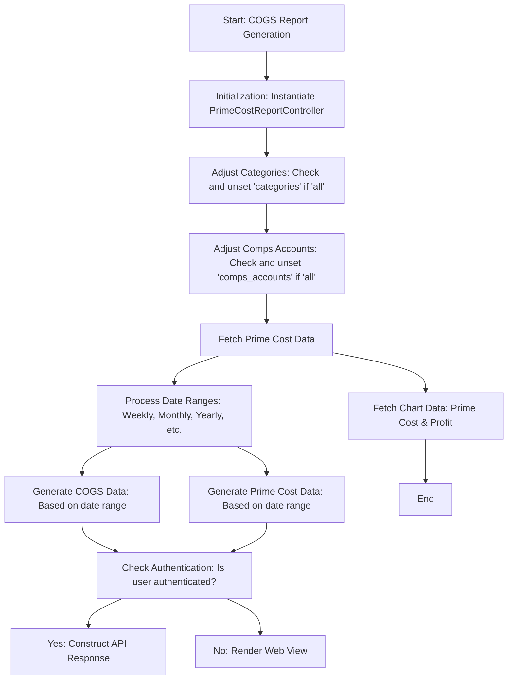

#### `/report/cogs-report/detailed/run` - `POST`

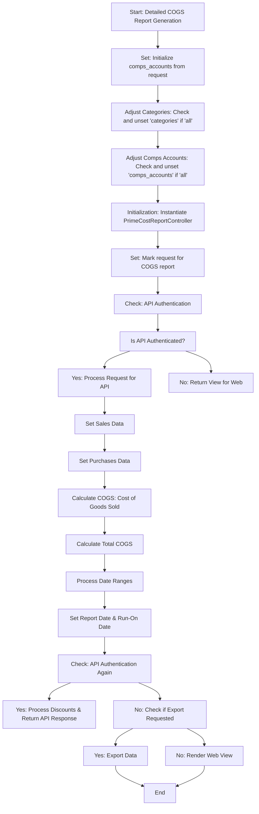

#### `/report/compare-report` - `POST`

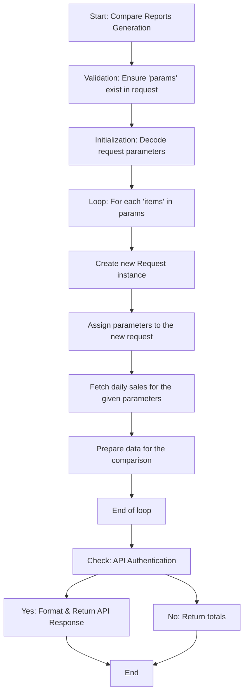

#### `/report/detailed/cogs-report` - `GET`

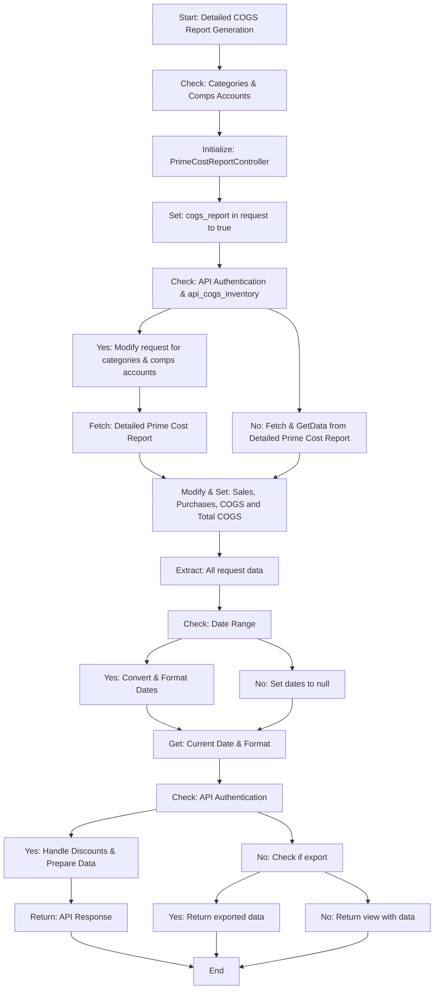

#### `/report/detailed/prime-cost-report` - `POST`

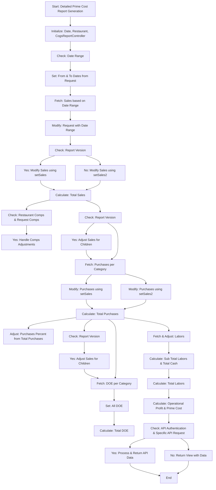

#### `/report/detailed/purchase-report` - `GET`

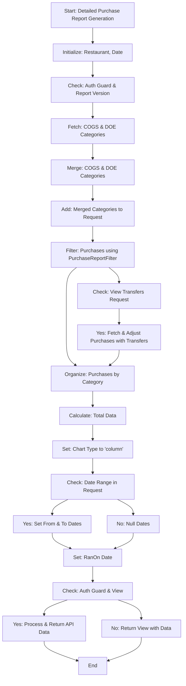

#### `/report/guest-count` - `GET`

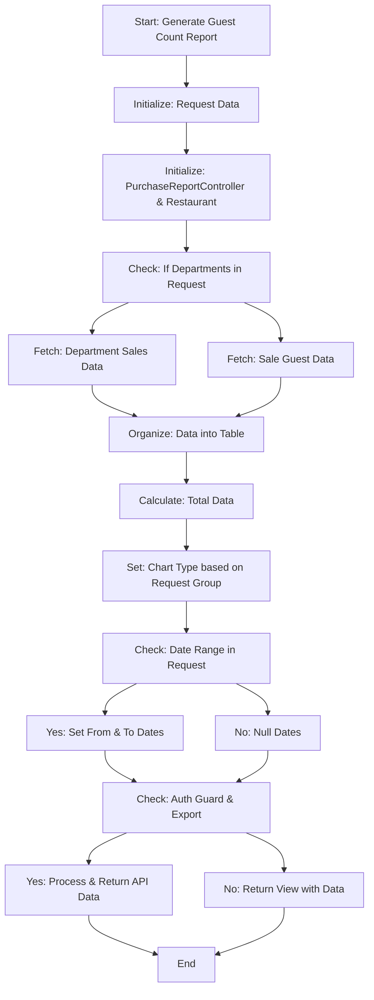

#### `/report/inventory` - `GET`

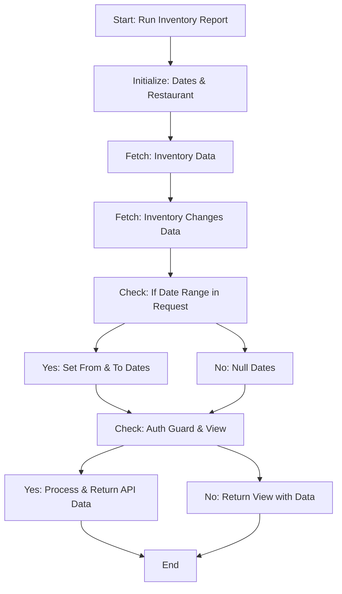

#### `/report/labor` - `GET`

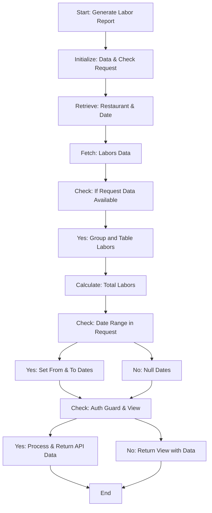

#### `/report/labor/detailed/category` - `GET`

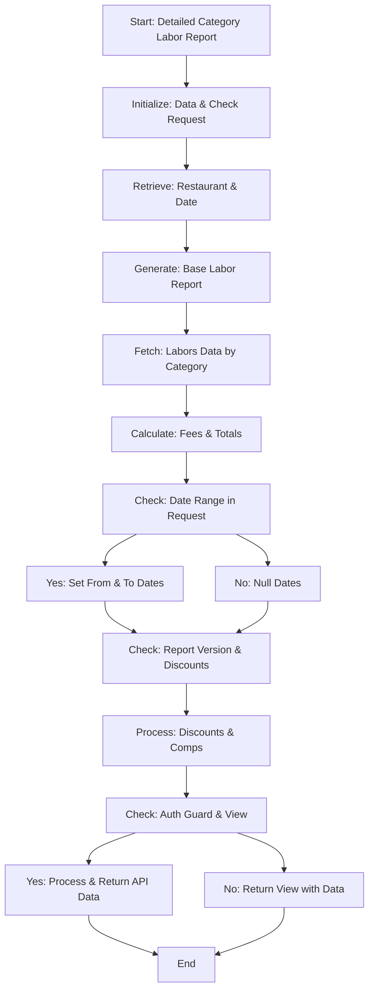

#### `/report/labor/efficiency` - `GET`

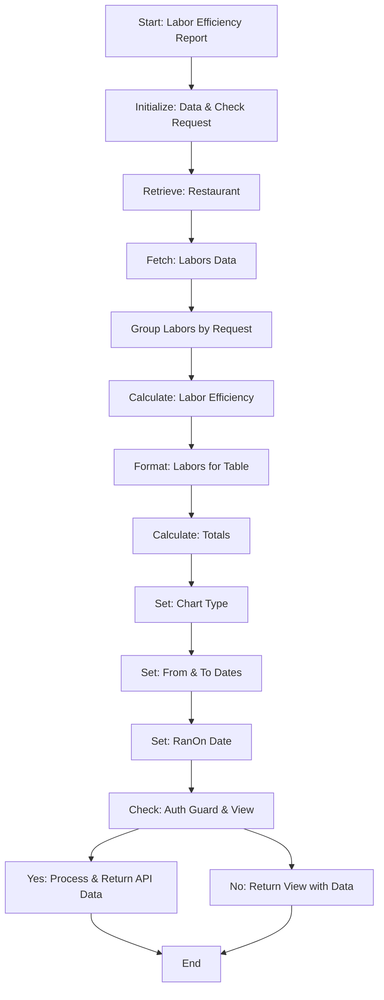

#### `/report/labor/efficiency/export` - `POST`

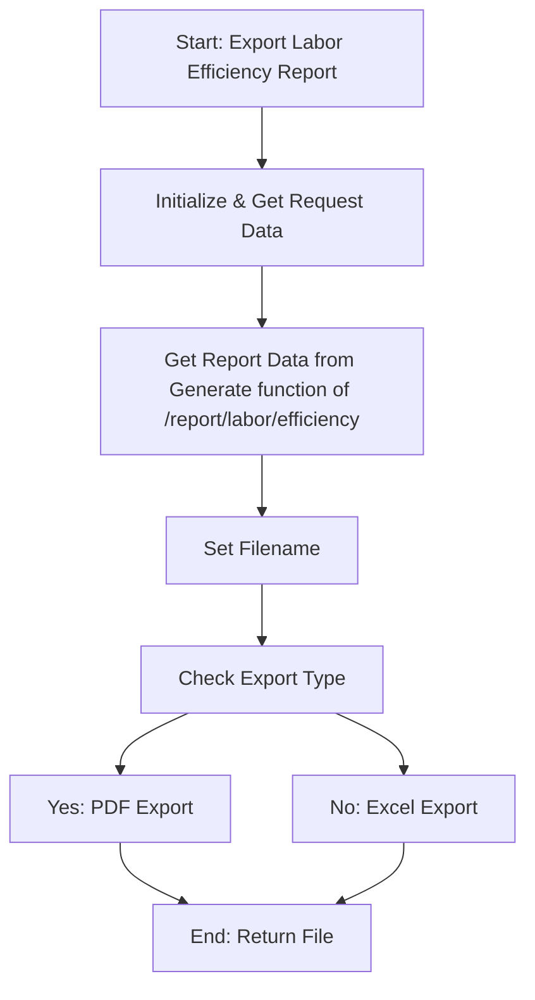

#### `/report/prime-cost-report` - `GET`

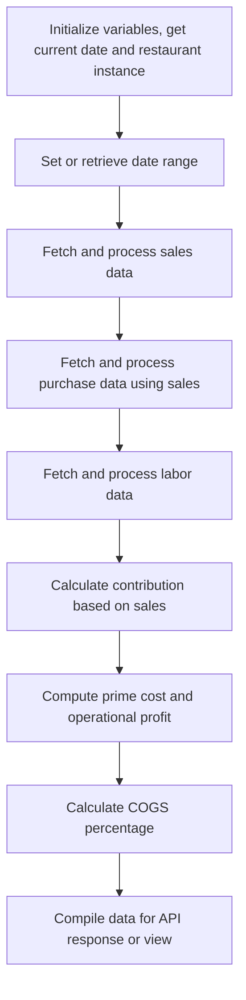
