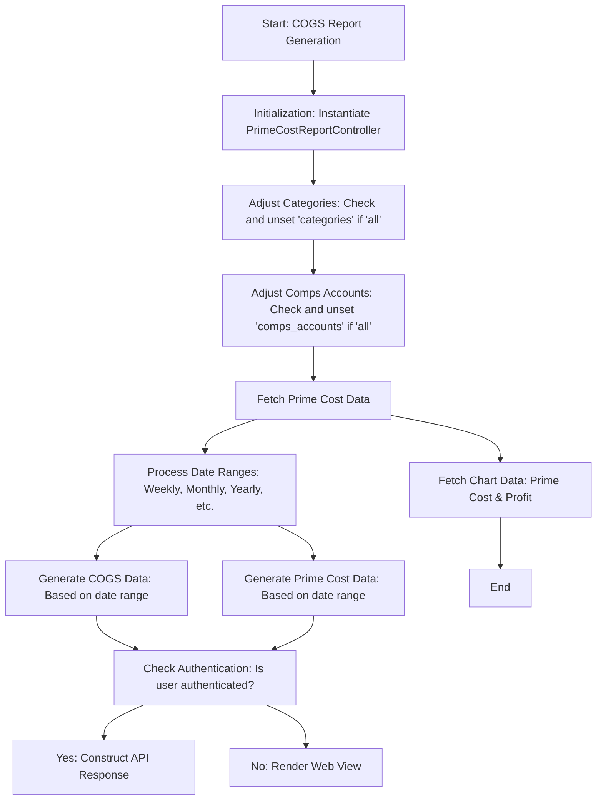
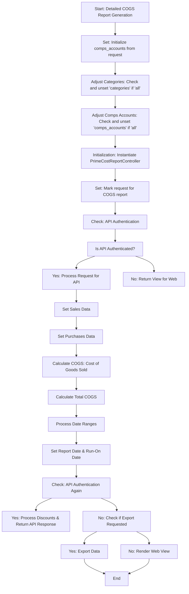
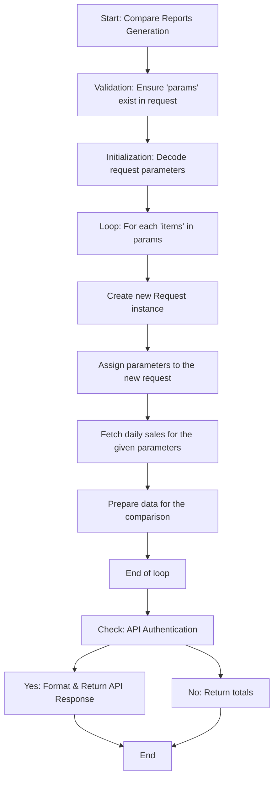
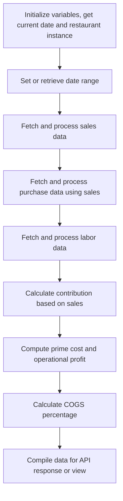

# Technical Documentation

#### `/report/cogs-report`

```mermaid
   graph TD
      A[Start: COGS Report Generation]
      B[Initialization: Instantiate PrimeCostReportController]
      C[Adjust Categories: Check and unset 'categories' if 'all']
      D[Adjust Comps Accounts: Check and unset 'comps_accounts' if 'all']
      E[Fetch Prime Cost Data]
      F[Check Authentication: Is user authenticated?]
      G[Yes: Construct API Response]
      H[No: Render Web View]
      I[Process Date Ranges: Weekly, Monthly, Yearly, etc.]
      J[Generate COGS Data: Based on date range]
      K[Generate Prime Cost Data: Based on date range]
      L[Fetch Chart Data: Prime Cost & Profit]
      M[End]

      A --> B
      B --> C
      C --> D
      D --> E
      E --> I
      I --> J
      J --> F
      I --> K
      K --> F
      F --> G
      F --> H
      E --> L
      L --> M
```

#### `/report/cogs-report/detailed/run`

```mermaid
   graph TD
      A[Start: Detailed COGS Report Generation]
      B[Set: Initialize comps_accounts from request]
      C[Adjust Categories: Check and unset 'categories' if 'all']
      D[Adjust Comps Accounts: Check and unset 'comps_accounts' if 'all']
      E[Initialization: Instantiate PrimeCostReportController]
      F[Set: Mark request for COGS report]
      G[Check: API Authentication]
      H[Is API Authenticated?]
      I[Yes: Process Request for API]
      J[No: Return View for Web]
      K[Set Sales Data]
      L[Set Purchases Data]
      M[Calculate COGS: Cost of Goods Sold]
      N[Calculate Total COGS]
      O[Process Date Ranges]
      P[Set Report Date & Run-On Date]
      Q[Check: API Authentication Again]
      R[Yes: Process Discounts & Return API Response]
      S[No: Check if Export Requested]
      T[Yes: Export Data]
      U[No: Render Web View]
      V[End]

      A --> B
      B --> C
      C --> D
      D --> E
      E --> F
      F --> G
      G --> H
      H --> I
      H --> J
      I --> K
      K --> L
      L --> M
      M --> N
      N --> O
      O --> P
      P --> Q
      Q --> R
      Q --> S
      S --> T
      S --> U
      T --> V
      U --> V
```

#### `/report/compare-report`

```mermaid
   graph TD
      A[Start: Compare Reports Generation]
      B[Validation: Ensure 'params' exist in request]
      C[Initialization: Decode request parameters]
      D[Loop: For each 'items' in params]
      E[Create new Request instance]
      F[Assign parameters to the new request]
      G[Fetch daily sales for the given parameters]
      H[Prepare data for the comparison]
      I[End of loop]
      J[Check: API Authentication]
      K[Yes: Format & Return API Response]
      L[No: Return totals]
      M[End]

      A --> B
      B --> C
      C --> D
      D --> E
      E --> F
      F --> G
      G --> H
      H --> I
      I --> J
      J --> K
      J --> L
      K --> M
      L --> M
```

#### `/report/prime-cost-report`

```mermaid
   graph TD
      A[Initialize variables, get current date and restaurant instance] --> B[Set or retrieve date range]
      B --> C[Fetch and process sales data]
      C --> D[Fetch and process purchase data using sales]
      D --> E[Fetch and process labor data]
      E --> F[Calculate contribution based on sales]
      F --> G[Compute prime cost and operational profit]
      G --> H[Calculate COGS percentage]
      H --> I[Compile data for API response or view]
```
